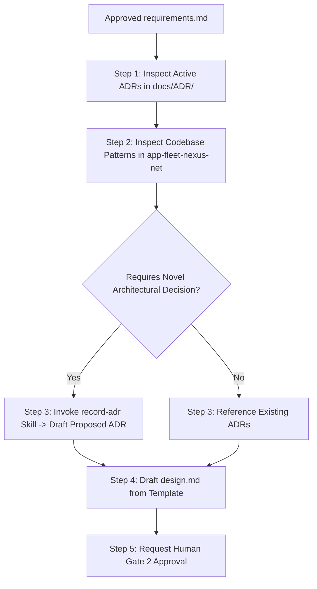

# Architecture Analysis Skill

This skill governs the Architectural Evaluation, Pattern Alignment, and Design Specification workflow for FleetNexus features.

---

## 1. Operating Rules & Boundaries

1. **Precondition Enforcement**: NEVER begin architecture analysis until `requirements.md` is approved by the human (Human Gate 1).
2. **Pattern Reuse Over Invention**: Prefer existing architectural abstractions, repository conventions, and security patterns unless there is a documented reason to deviate.
3. **Mandatory ADR Check**: Evaluate all matching ADRs in `docs/ADR/README.md`. If a new pattern or architectural shift is introduced, invoke the `record-adr` skill.
4. **Artifact Production**: Write durable artifacts to `docs/features/FEATURE-XXX/design.md` and update `status.md` to `ARCHITECTURE_REVIEW`.

---

## 2. Step-by-Step Architecture Workflow

### Step 1: Discover Active ADRs
Inspect [docs/ADR/README.md](file:///c:/Learn/fleet_solution/docs/ADR/README.md) and identify active decisions governing:
- **Multi-Tenancy**: [ADR-003](file:///c:/Learn/fleet_solution/docs/ADR/ADR-003-multi-tenancy-shared-schema.md), [ADR-004](file:///c:/Learn/fleet_solution/docs/ADR/ADR-004-tenant-isolation-defense-in-depth.md), [ADR-007](file:///c:/Learn/fleet_solution/docs/ADR/ADR-007-single-tenant-membership-mvp.md)
- **Security & RBAC**: [ADR-001](file:///c:/Learn/fleet_solution/docs/ADR/ADR-001-authentication-provider-supabase.md), [ADR-005](file:///c:/Learn/fleet_solution/docs/ADR/ADR-005-stateless-jwt-validation.md), [ADR-010](file:///c:/Learn/fleet_solution/docs/ADR/ADR-010-role-based-access-control.md), [ADR-011](file:///c:/Learn/fleet_solution/docs/ADR/ADR-011-security-library-decoupling.md)
- **Data & Entity Persistence**: [ADR-013](file:///c:/Learn/fleet_solution/docs/ADR/ADR-013-user-profile-and-contact-separation.md), [ADR-014](file:///c:/Learn/fleet_solution/docs/ADR/ADR-014-soft-delete-and-audit-strategy.md), [ADR-017](file:///c:/Learn/fleet_solution/docs/ADR/ADR-017-tenant-scoped-soft-delete-unique-constraints.md)
- **Caching & Performance**: [ADR-015](file:///c:/Learn/fleet_solution/docs/ADR/ADR-015-dashboard-kpi-inmemory-caching.md)
- **Frontend / UX**: [ADR-018](file:///c:/Learn/fleet_solution/docs/ADR/ADR-018-multi-step-input-wizard-ux-pattern.md), [ADR-019](file:///c:/Learn/fleet_solution/docs/ADR/ADR-019-state-aware-root-routing.md), [ADR-020](file:///c:/Learn/fleet_solution/docs/ADR/ADR-020-unified-inventory-workspace.md)

### Step 2: Codebase Pattern Inspection
Examine the active layers in `app-fleet-nexus-net/`:
- `api/appfleet-nexus-data/`: Entity configurations, DbContext query filters, repository patterns.
- `api/appfleet-nexus-security/`: Tenant provider, claims extraction, authorization handlers.
- `api/appfleet-nexus-api/`: Controller routing conventions, DTO structure, FluentValidation patterns, MediatR / Service handlers.
- `ui/`: Component layout, React/Vite stores, API clients.

### Step 3: Architecture Decision Formulation
If novel patterns are required (e.g. new external integration, new storage engine, new event pipeline):
- Invoke `record-adr` skill to draft `docs/ADR/ADR-###-[kebab-title].md` with status `Proposed`.

### Step 4: Author `design.md`
Copy `docs/features/_templates/design.template.md` to `docs/features/FEATURE-XXX/design.md`.
Document:
- Affected component boundaries across frontend, API, data, and security layers.
- Sequence / Data Flow diagrams (`mermaid`).
- Failure handling, idempotency, retry mechanisms, and observability metrics.
- Active ADR compliance table.

### Step 5: Human Gate 2 Sign-Off
Present `design.md` and any proposed ADRs to the user for explicit approval.
**Do NOT proceed to Implementation Planning until Human Gate 2 is marked `APPROVED`.**
