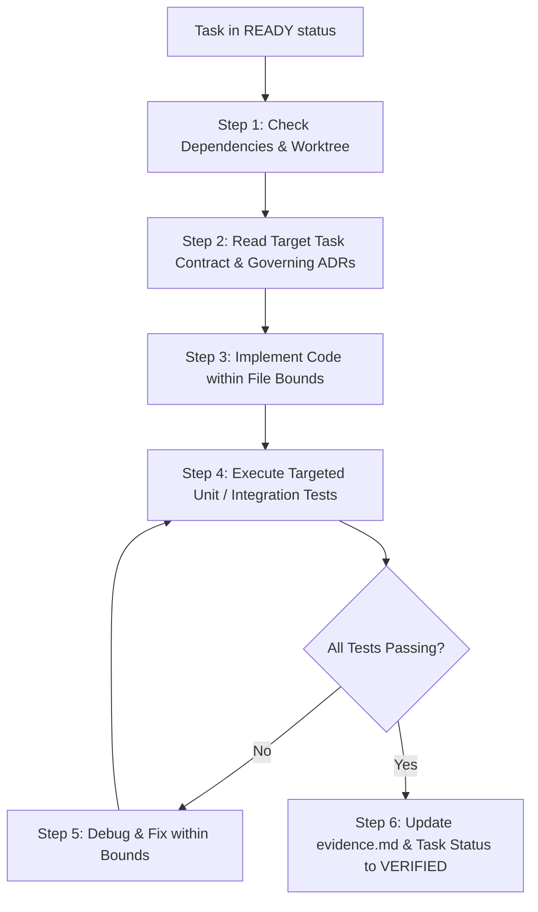

# Developer Agent & Controlled Coding Skill

This skill governs the Implementation, Targeted Test Execution, and Evidence Logging workflow for atomic tasks.

---

## 1. Operating Rules & Boundaries

1. **Strict Context Contracts**: Modify ONLY the files listed in the task contract (`docs/features/FEATURE-XXX/tasks/###-*.md`). Never make unrelated sweeping changes across the repository.
2. **Follow Existing Patterns**: Adhere strictly to governing ADRs (e.g. `ADR-003` for multi-tenancy, `ADR-014` for soft deletes and audit fields).
3. **Never Fake Evidence**: Run actual compiler builds and automated test suites (`dotnet test`). Every claim in `evidence.md` must be verifiable.
4. **Deviation Classification**:
   - If an unexpected minor helper is needed $\rightarrow$ Class A (auto-reconcile in task record).
   - If an existing abstraction is reused differently $\rightarrow$ Class B (record in task and flag in evidence).
   - If a requirement cannot be met or architecture must change $\rightarrow$ Class C / D (**HALT & REQUEST HUMAN DECISION**).

---

## 2. Step-by-Step Task Execution Workflow



### Step 1: Preflight & Context Check
Before writing any code:
1. Verify all prior dependency tasks in `dependencies` list are marked `VERIFIED`.
2. Inspect the task contract (`docs/features/FEATURE-XXX/tasks/###-*.md`) for:
   - `Files In-Scope`
   - `Acceptance Criteria` (`AC-xxx`)
   - `Design References` (governing ADRs)

### Step 2: Implement Code Changes
- Write clean, maintainable C# / TypeScript following existing repository conventions.
- Maintain soft-delete (`ISoftDeletable`), audit timestamps (`IAuditableEntity`), and multi-tenant filters (`TenantId`).
- Add appropriate error handling and logging.

### Step 3: Run Targeted Tests
Execute the specific test project or filtered test class:
```powershell
# In .NET API Tests:
dotnet test c:\Learn\fleet_solution\app-fleet-nexus-net\api\appfleet-nexus-api.Tests --filter "FullyQualifiedName~TargetTests"
```

### Step 4: Record Machine-Verifiable Evidence
Update `docs/features/FEATURE-XXX/evidence.md`:
1. Change status from `UNVERIFIED` to `VERIFIED`.
2. Record the exact source file line (`src/.../File.cs:42`) and test line (`tests/.../Test.cs:18`).
3. Paste the passing test execution summary into the Test Execution Log section.
4. Mark the task contract (`tasks/###-*.md`) status as `VERIFIED`.
