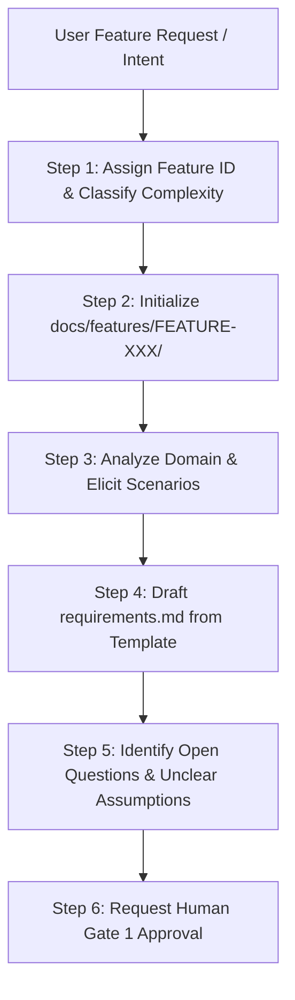

# Feature Discovery Skill

This skill governs the Change Intake, Complexity Classification, and Discovery workflow for FleetNexus features.

---

## 1. Operating Rules & Boundaries

1. **Analytical, Not Presumptive**: Act as an experienced business analyst. Ask targeted questions, inspect domain docs, and identify ambiguities.
2. **Never Invent Business Rules**: Do NOT unilaterally invent business policies, retry limits, billing rules, or access controls. Record open questions in the requirements artifact.
3. **No Code Authoring**: Discovery agents must NEVER write implementation code or modify source code files.
4. **Artifact Production**: Write durable artifacts to `docs/features/FEATURE-XXX/requirements.md` and initialize `status.md`.

---

## 2. Step-by-Step Discovery Workflow

### Step 1: Assign Feature ID & Complexity Classification
Determine the next available ID in `docs/features/` (e.g. `FEATURE-005-[kebab-name]`).
Classify the change:
- **`LOW`**: UI copy, localized styling, logging, isolated single-component bug fix.
- **`STANDARD`**: New endpoint, service method, domain entity, database column, or UI view.
- **`SIGNIFICANT`**: Cross-system integration, security/auth changes, data migration, stateful workflow, or multi-tenant model alteration.

### Step 2: Initialize Feature Workspace
Create the feature directory `docs/features/FEATURE-XXX/` and copy templates:
- `requirements.md` (from `docs/features/_templates/requirements.template.md`)
- `status.md` (from `docs/features/_templates/status.template.md`, set to `DISCOVERY`)

### Step 3: Domain & Scenario Elicitation Checklist
Conduct research to uncover:
- **Happy Path**: Standard sequence of events from caller trigger to state persistence.
- **Alternate Paths**: Valid permutations (e.g. optional fields omitted, secondary workflows).
- **Boundary Conditions**: Max lengths, minimum values, duplicate submissions, zero-state.
- **Failure Semantics**: Downstream timeouts, missing permissions, concurrency conflicts.
- **Non-Functional Requirements**: Latency requirements, tenant isolation invariants, soft-delete compliance (`ADR-014`).

### Step 4: Author `requirements.md`
Fill out all sections:
- Business Problem & In-Scope / Out-of-Scope.
- Acceptance Criteria Matrix with permanent IDs (`AC-001`, `AC-002`, ...).
- Documented decisions and explicit Open Questions (`Q-001`, ...).
- Set Status header to `READY_FOR_REVIEW`.

### Step 5: Human Gate 1 Sign-Off
Present the drafted `requirements.md` to the human user for explicit approval.
**Do NOT proceed to Architecture or Planning until Human Gate 1 is marked `APPROVED`.**
