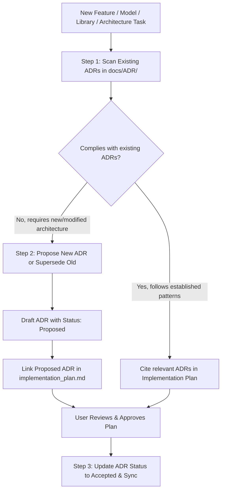

# Architecture Decision Record (ADR) Governance & Lifecycle Skill

This skill governs architectural alignment, decision discovery, and formal documentation of Architectural Decision Records (ADRs) in FleetNexus.

---

## 1. When to Invoke This Skill

### Mandatory Triggers
Invoke this skill **before drafting an implementation plan or writing code** for:
1. **Major New Features or Modules** (e.g., Contacts, Maintenance, Fuel Logs, Driver Management).
2. **Data Model & Schema Changes** (e.g., adding new tables, altering relationships, changing tenancy models).
3. **Library & Dependency Adoption** (e.g., new NuGet packages, UI component libraries, external SDKs).
4. **Architectural Shifts & Refactoring** (e.g., switching caching layers, changing auth protocols, altering API conventions).

### Excluded / Bypass Changes
The following do not require an ADR review:
* Simple bug fixes and regression patches.
* Minor UI styling, CSS tweaks, and text/copy updates.
* Routine unit test additions.

---

## 2. Core Governance Workflows



---

### Workflow A: Pre-Implementation Compliance Check (Scan & Align)

Before creating or editing code / implementation plans:
1. **Dynamic ADR Discovery**: Read [docs/ADR/README.md](file:///c:/Learn/fleet_solution/docs/ADR/README.md) to inspect the full, current index of accepted ADRs.
2. **Filter by Relevant Domain**: Identify and review all active (non-superseded) ADRs matching the technical domains affected by the current task (e.g., Multi-Tenancy, Data Architecture, Security, Caching, UX Patterns, Infrastructure).
3. **Verify Invariants**: Ensure the proposed design adheres to the architectural constraints, base classes, and patterns established across those matching ADRs.
4. **Cite in Implementation Plan**: In `implementation_plan.md`, explicitly reference the discovered governing ADRs by title and link:
   ```markdown
   ### Architectural Alignment
   - Conforms to [ADR-###: Title](docs/ADR/ADR-###-title.md) for [brief reason].
   - Conforms to [ADR-###: Title](docs/ADR/ADR-###-title.md) for [brief reason].
   ```

---

### Workflow B: Proactive Decision Drafting (New Architectural Decision)

When a task introduces a novel architecture decision, new entity structure, new library, or unrecorded pattern:

1. **Determine the Next ADR Number**: Check [docs/ADR/README.md](file:///c:/Learn/fleet_solution/docs/ADR/README.md) for the next available 3-digit sequence (e.g., `ADR-022`).
2. **Draft the ADR Document**:
   * Path: `docs/ADR/ADR-[###]-[kebab-case-short-title].md`
   * Initial Status: `Proposed`
   * Date: Current date (`YYYY-MM-DD`)
3. **Formulate the Content**:
   * **Context & Problem Statement**: State the exact technical/business constraint driving the choice.
   * **Decision**: Detail the proposed pattern and architectural path.
   * **Alternatives Considered**: Document what alternatives were evaluated and the specific technical rationale for rejecting them.
   * **Consequences & Trade-offs**: Outline positive impacts, risks/trade-offs, and future migration paths.
4. **Link in the Implementation Plan**: Reference the proposed ADR in `implementation_plan.md`:
   ```markdown
   ### Proposed Architecture Decisions
   - Proposes [ADR-###: Short Title](docs/ADR/ADR-###-short-title.md) (Status: Proposed)
   ```
5. **Promote to Accepted**: Once the user approves the implementation plan, update the ADR status to `Accepted`, record it in the master index, and sync files.

---

### Workflow C: Decision Evolution & Superseding

When a new decision replaces or alters a previously approved ADR:
1. Update the older ADR's status header:
   ```markdown
   * **Status**: Superseded by [ADR-###](ADR-###-new-decision-title.md)
   ```
2. Author the new ADR, linking back to the superseded ADR in the *Context* section.
3. Update [docs/ADR/README.md](file:///c:/Learn/fleet_solution/docs/ADR/README.md) to reflect the updated statuses.

---

## 3. Storage & Naming Standards

* **Primary Directory**: `docs/ADR/`
* **Mirror Directory**: `app-fleet-nexus-net/docs/ADR/`
* **Master Index**: `docs/ADR/README.md`
* **File Naming Format**: `ADR-[###]-[kebab-case-short-title].md` (zero-padded 3 digits, e.g. `ADR-022-contact-entity-relations.md`).

---

## 4. Mandatory ADR Markdown Template

```markdown
# ADR-[###]: [Short Descriptive Title]

* **Status**: [Proposed | Accepted | Deferred | Deprecated | Superseded by ADR-xxx]
* **Date**: YYYY-MM-DD

---

## Context & Problem Statement
[What technical or business constraint necessitated this decision.]

---

## Decision
[The chosen path and architecture pattern.]

---

## Alternatives Considered
[What else was evaluated and why it was rejected. If none recorded, write: Not Available]

---

## Consequences & Trade-offs
* **Positive Impacts**: [List key advantages]
* **Risks & Trade-offs**: [List known constraints or risks]
* **Migration Paths**: [Ease/path of future changes, or Not Available]
```

---

## 5. Master Index Synchronization

Whenever an ADR is created, updated, or superseded:
1. Update the table in [docs/ADR/README.md](file:///c:/Learn/fleet_solution/docs/ADR/README.md):
   ```markdown
   | [ADR-###](ADR-###-[kebab-case-title].md) | [Title] | [Category] | [Status] | [Date] |
   ```
2. Sync all files in `docs/ADR/` to `app-fleet-nexus-net/docs/ADR/`.
