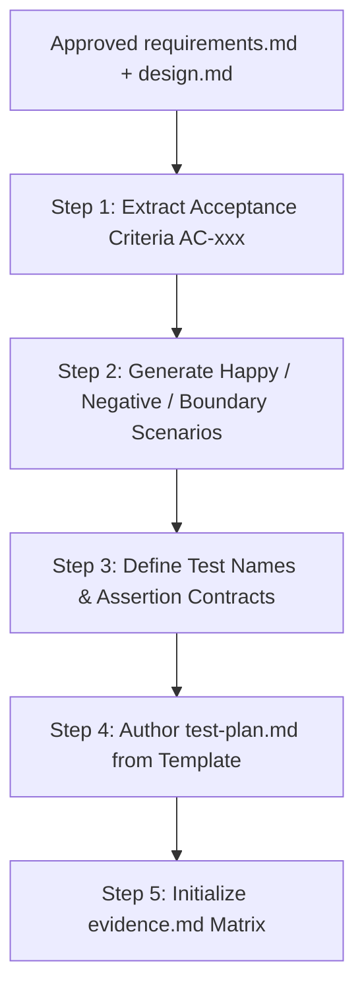

# Independent Test Design Skill

This skill governs the Formulation of Independent Test Plans and Requirements-to-Test Traceability Matrices.

---

## 1. Operating Rules & Boundaries

1. **Independent Test Design Principle**: Test cases MUST be derived from requirements (`requirements.md`), acceptance criteria (`AC-xxx`), and failure semantics **independently of implementation code**.
2. **Eliminate Self-Fulfilling Tests**: Never design tests simply by reading what the developer wrote. Design tests to prove the business intent and verify edge cases.
3. **Traceability Anchor**: Assign unique `TEST-xxx` IDs mapped 1-to-1 or 1-to-many to `AC-xxx` criteria.
4. **Artifact Production**: Write durable artifacts to `docs/features/FEATURE-XXX/test-plan.md` and initialize `evidence.md`.

---

## 2. Test Category Spectrum

Ensure the test suite comprehensively covers the full verification spectrum:

| Category | Goal | Example Scenario |
| :--- | :--- | :--- |
| **Happy Path** | Validate primary intended behavior | Create valid entity $\to$ returns HTTP 201 with generated ID |
| **Alternate Path** | Validate non-default valid paths | Create entity with optional fields omitted $\to$ succeeds |
| **Validation / Negative** | Validate payload and field rules | Missing required property $\to$ returns HTTP 400 Bad Request |
| **Boundary / Limit** | Validate minimum, maximum, and zero limits | String at exact maximum length (e.g. 100 chars) $\to$ accepted; 101 chars $\to$ rejected |
| **Multi-Tenancy** | Verify tenant isolation invariants | Request with Tenant A cannot read or mutate Tenant B records |
| **Failure & Recovery** | Verify resilience under stress | Database retry policy activates on transient connection exception |
| **Soft Delete & Audit** | Verify compliance with ADR-014 | Soft-deleted record is excluded from standard queries |

---

## 3. Step-by-Step Test Design Workflow

### Step 1: Extract Acceptance Criteria
Read `docs/features/FEATURE-XXX/requirements.md` and extract all criteria (`AC-001`, `AC-002`, ...).

### Step 2: Formulate Concrete Test Assertions
For each criteria, formulate one or more test specifications (`TEST-001`, `TEST-002`, ...) detailing:
- **Given**: Initial context, user authentication, tenant context.
- **When**: The action or endpoint called with specific payload.
- **Then**: Expected status code, response DTO assertions, database state assertions.

### Step 3: Author `test-plan.md`
Copy `docs/features/_templates/test-plan.template.md` to `docs/features/FEATURE-XXX/test-plan.md`.
Fill out the Requirements-to-Test Traceability Matrix and test execution commands.

### Step 4: Initialize `evidence.md`
Copy `docs/features/_templates/evidence.template.md` to `docs/features/FEATURE-XXX/evidence.md` with status `UNVERIFIED` for each row, ready to be filled during Developer execution.
