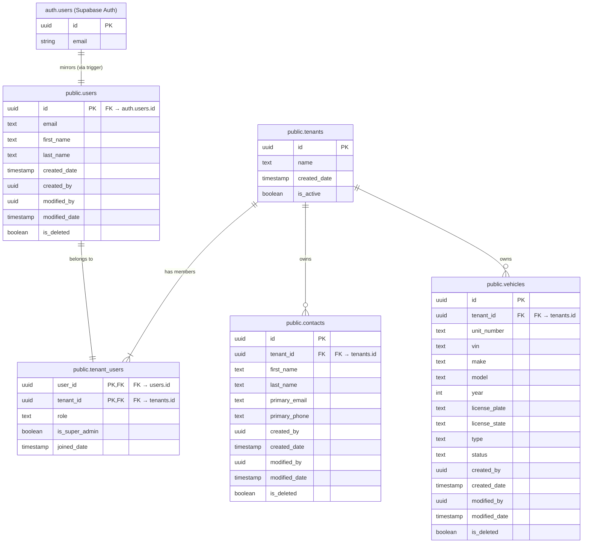

# Database Schema and Relations

This document details the database schema, entity relationships, and architectural decisions for core business tables in FleetNexus. 

---

## 1. Schema Overview & Relations (ERD)

The database utilizes a tenant-scoped multi-tenancy model. Every tenant-scoped entity inherits from a base set of fields that support tenant isolation, soft-deletion, and automatic change auditing.



---

## 2. Core Entities & Mappings

### Base Structure (`BaseEntity`)
Most tenant-scoped models in .NET inherit from [BaseEntity.cs](file:///c:/Learn/fleet_solution/app-fleet-nexus-net/api/appfleet-nexus-data/Models/BaseEntity.cs), which maps to the following common columns in PostgreSQL:

| C# Property | SQL Column | Type | Nullable | Description |
| :--- | :--- | :--- | :--- | :--- |
| `Id` | `id` | `UUID` | No | Primary Key |
| `TenantId` | `tenant_id` | `UUID` | No | Tenant owner of the record |
| `CreatedBy` | `created_by` | `UUID` | No | User ID who created the record |
| `CreatedDate` | `created_date` | `TIMESTAMPTZ` | No | Date/Time of creation |
| `ModifiedBy` | `modified_by` | `UUID` | Yes | User ID who last modified the record |
| `ModifiedDate`| `modified_date` | `TIMESTAMPTZ` | Yes | Date/Time of last modification |
| `IsDeleted` | `is_deleted` | `BOOLEAN` | No | Soft-delete flag (default: `FALSE`) |

---

### A. Vehicle Entity (`public.vehicles`)
Represents fleet vehicles (trucks, trailers, etc.) belonging to a specific tenant.
* **C# Model**: [Vehicle.cs](file:///c:/Learn/fleet_solution/app-fleet-nexus-net/api/appfleet-nexus-data/Models/Vehicle.cs)
* **Table Constraint**: A unique index prevents duplicate unit numbers for active (non-deleted) vehicles within the same tenant.

#### SQL Definition
```sql
CREATE TABLE public.vehicles (
    id              UUID PRIMARY KEY DEFAULT gen_random_uuid(),
    tenant_id       UUID NOT NULL,

    -- Domain fields
    unit_number     TEXT NOT NULL,
    vin             TEXT,
    make            TEXT,
    model           TEXT,
    year            INT,
    license_plate   TEXT,
    license_state   TEXT,
    type            TEXT,                               -- 'Truck', 'Trailer', etc.
    status          TEXT NOT NULL DEFAULT 'Active',     -- 'Active', 'Inactive', 'Maintenance'

    -- Audit columns
    created_by      UUID NOT NULL,
    created_date    TIMESTAMPTZ NOT NULL DEFAULT NOW(),
    modified_by     UUID,
    modified_date   TIMESTAMPTZ,

    -- Soft delete
    is_deleted      BOOLEAN NOT NULL DEFAULT FALSE,

    CONSTRAINT fk_vehicles_tenant FOREIGN KEY (tenant_id)
        REFERENCES public.tenants(id) ON DELETE CASCADE
);

CREATE INDEX idx_vehicles_tenant ON public.vehicles (tenant_id) WHERE NOT is_deleted;

CREATE UNIQUE INDEX idx_vehicles_tenant_unit
    ON public.vehicles (tenant_id, unit_number) WHERE NOT is_deleted;
```

---

### B. Contact Entity (`public.contacts`)
Represents business contacts (such as customers, vendors, and partners) associated with a tenant.
* **C# Model**: [Contact.cs](file:///c:/Learn/fleet_solution/app-fleet-nexus-net/api/appfleet-nexus-data/Models/Contact.cs)
* **Architectural Decision (AD-13)**: The user's account name lives directly in the `users` table, keeping `contacts` as a separate business entity with no direct foreign key relation to users. This avoids circular dependencies and join performance issues.

#### SQL Definition
```sql
CREATE TABLE public.contacts (
    id              UUID PRIMARY KEY DEFAULT gen_random_uuid(),
    tenant_id       UUID NOT NULL,

    -- Domain fields
    first_name      TEXT NOT NULL,
    last_name       TEXT NOT NULL,
    primary_email   TEXT,
    primary_phone   TEXT,

    -- Audit columns
    created_by      UUID NOT NULL,
    created_date    TIMESTAMPTZ NOT NULL DEFAULT NOW(),
    modified_by     UUID,
    modified_date   TIMESTAMPTZ,

    -- Soft delete
    is_deleted      BOOLEAN NOT NULL DEFAULT FALSE,

    CONSTRAINT fk_contacts_tenant FOREIGN KEY (tenant_id)
        REFERENCES public.tenants(id) ON DELETE CASCADE
);

CREATE INDEX idx_contacts_tenant ON public.contacts (tenant_id) WHERE NOT is_deleted;
```

---

### C. Tenant Entity (`public.tenants`)
Represents a corporate customer/organization. It does not inherit from `BaseEntity`.
* **C# Model**: [Tenant.cs](file:///c:/Learn/fleet_solution/app-fleet-nexus-net/api/appfleet-nexus-data/Models/Tenant.cs)

#### SQL Definition
```sql
CREATE TABLE public.tenants (
    id              UUID PRIMARY KEY DEFAULT gen_random_uuid(),
    name            TEXT NOT NULL,
    created_date    TIMESTAMPTZ NOT NULL DEFAULT NOW(),
    is_active       BOOLEAN NOT NULL DEFAULT TRUE
);
```

---

### D. User Entity (`public.users`)
Mirrors the identity database (`auth.users` in Supabase Auth) to allow relational queries inside the public schema. 
* **C# Model**: [User.cs](file:///c:/Learn/fleet_solution/app-fleet-nexus-net/api/appfleet-nexus-data/Models/User.cs)

#### SQL Definition
```sql
CREATE TABLE public.users (
    id              UUID PRIMARY KEY,                       -- Mirrors auth.users.id
    email           TEXT NOT NULL,
    first_name      TEXT,
    last_name       TEXT,
    created_date    TIMESTAMPTZ NOT NULL DEFAULT NOW(),

    -- Audit columns
    created_by      UUID,                                   -- NULL on self-signup
    modified_by     UUID,
    modified_date   TIMESTAMPTZ,

    -- Soft delete
    is_deleted      BOOLEAN NOT NULL DEFAULT FALSE,

    CONSTRAINT fk_users_auth FOREIGN KEY (id)
        REFERENCES auth.users(id) ON DELETE CASCADE
);

CREATE UNIQUE INDEX idx_users_email ON public.users (email);
```

---

### E. Tenant User Membership (`public.tenant_users`)
Associates a User with a Tenant, defining their access role.
* **C# Model**: [TenantUser.cs](file:///c:/Learn/fleet_solution/app-fleet-nexus-net/api/appfleet-nexus-data/Models/TenantUser.cs)

#### SQL Definition
```sql
CREATE TABLE public.tenant_users (
    user_id         UUID NOT NULL,
    tenant_id       UUID NOT NULL,
    role            TEXT NOT NULL DEFAULT 'Member'
                        CHECK (role IN ('Admin', 'Member')),
    is_super_admin  BOOLEAN NOT NULL DEFAULT FALSE,
    joined_date     TIMESTAMPTZ NOT NULL DEFAULT NOW(),

    PRIMARY KEY (user_id, tenant_id),

    CONSTRAINT fk_tu_user FOREIGN KEY (user_id)
        REFERENCES public.users(id) ON DELETE CASCADE,
    CONSTRAINT fk_tu_tenant FOREIGN KEY (tenant_id)
        REFERENCES public.tenants(id) ON DELETE CASCADE
);

-- Enforces single-tenant-per-user during the current release
CREATE UNIQUE INDEX idx_tenant_users_one_tenant_per_user
    ON public.tenant_users (user_id);
```

---

## 3. Automation and Security Features

### A. Auto-Provisioning (`handle_new_user()`)
When a new user signs up via Supabase Auth, a PostgreSQL trigger fires `handle_new_user()`. This function automatically creates:
1. A record in `public.users` matching their credentials.
2. A new `public.tenants` organization for them (e.g., "[First Name]'s Organization").
3. A record in `public.tenant_users` assigning them as `Admin` of that tenant.

```sql
CREATE OR REPLACE FUNCTION public.handle_new_user()
RETURNS TRIGGER
LANGUAGE plpgsql
SECURITY DEFINER
SET search_path = public
AS $$
DECLARE
    v_tenant_id     UUID;
    v_first_name    TEXT;
    v_last_name     TEXT;
BEGIN
    v_first_name := NEW.raw_user_meta_data ->> 'first_name';
    v_last_name  := NEW.raw_user_meta_data ->> 'last_name';

    IF v_first_name IS NULL OR v_first_name = '' THEN
        v_first_name := split_part(NEW.email, '@', 1);
    END IF;

    -- 1. Create public.users row
    INSERT INTO public.users (id, email, first_name, last_name, created_date)
    VALUES (NEW.id, NEW.email, v_first_name, v_last_name, NOW());

    -- 2. Create a new tenant
    v_tenant_id := gen_random_uuid();
    INSERT INTO public.tenants (id, name, created_date, is_active)
    VALUES (v_tenant_id, COALESCE(v_first_name, '') || '''s Organization', NOW(), TRUE);

    -- 3. Link user to tenant as Admin
    INSERT INTO public.tenant_users (user_id, tenant_id, role, is_super_admin, joined_date)
    VALUES (NEW.id, v_tenant_id, 'Admin', FALSE, NOW());

    RETURN NEW;
END;
$$;

CREATE TRIGGER on_auth_user_created
    AFTER INSERT ON auth.users
    FOR EACH ROW
    EXECUTE FUNCTION public.handle_new_user();
```

### B. Tenant Isolation
Security and isolation are enforced in two layers:
1. **Application Layer (EF Core)**: All entities inheriting from `BaseEntity` are subject to an EF Core Global Query Filter that automatically appends `tenant_id == current_tenant_id` and `is_deleted == false` to all queries.
2. **Database Layer (RLS)**: Row-Level Security (RLS) is enabled and forced on `public.vehicles` and `public.contacts` using transactional local variables (`app.current_tenant_id`).
