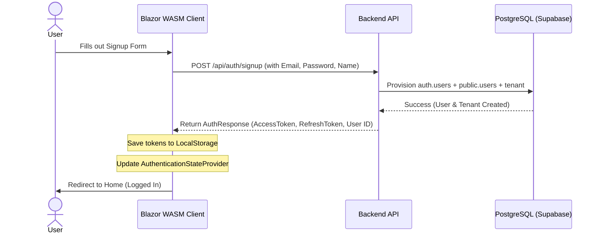

# Implementation Plan: Signup / Login Workflow

This document outlines the high-level plan for implementing user signup, login, and token-based state management within the Blazor WebAssembly frontend (`appfleet-nexus-ui`).

## Objectives
- **Seamless User Experience**: Quick and easy signup flow with automatic login (immediate redirect to home/dashboard) upon completion.
- **State Management**: Persist JWT access/refresh tokens in browser `localStorage` and integration with Blazor's built-in authentication system.
- **Visual Design**: Sleek, glassmorphic layout using modern typography and micro-animations to match high-end design principles.
- **API Connectivity**: Inject JWT Bearer tokens automatically to outgoing HTTP API calls for secure endpoint access.

---

## User Registration Schema
The signup flow only requires the user's **First Name**, **Last Name**, **Email Address**, and **Password** (confirmed twice). Custom usernames are not supported or required by the Supabase backend authentication model.

---

## Architectural Workflow

---

## Mobile-Friendly Design Guidelines
To ensure a high-fidelity mobile experience, the implementation will strictly follow these UX guidelines:
1. **Responsive Layouts**: Use Bootstrap 5 grid columns (e.g. `col-md-6 col-12`) so that inputs (like First/Last Name) stack vertically on mobile viewports but display side-by-side on larger screens.
2. **Keyboard Optimization**: Use proper attributes (`type="email"`, `inputmode="email"`, `autocapitalize="none"`, and `autocorrect="off"`) for form inputs to request standard, clean mobile keyboard layouts.
3. **Touch Target Sizing**: All input boxes and action buttons will have a height of at least `48px` to provide easy tap targets.
4. **Prevent Auto-Zooming**: Ensure standard form inputs have a `font-size` of `16px` (or `1rem`) to prevent iOS browsers from automatically zooming in when focusing fields, which disrupts the screen layout.
5. **Form Sizing Limits**: Apply `width: 100%; max-width: 480px;` and clear container padding so that the auth card scales gracefully from small mobile viewports (e.g. iPhone SE) up to desktop.
6. **Mobile Collapsible Menu Integration**: Dynamically handle navigation state and hide/show actions inside the responsive hamburger menu.

---

## Implementation Phases

### Phase 1: Authentication Infrastructure
- Add NuGet package `Microsoft.AspNetCore.Components.Authorization` to the client project.
- Create `CustomAuthenticationStateProvider` inheriting from standard `AuthenticationStateProvider` to manage and parse tokens.
- Add client-side validation models for login and signup.
- Register services in `Program.cs`.

### Phase 2: Shell Layout & Navigation
- Wrap the main application in `App.razor` with `CascadingAuthenticationState`.
- Update `NavMenu.razor` to dynamically show/hide routes depending on authorization state.
- Create a header bar in `MainLayout.razor` displaying the logged-in user profile or quick actions.

### Phase 3: Login Page (`/login`)
- Implement the Login UI using a glassmorphic card design.
- Handle forms submission and error display.

### Phase 4: Signup Page (`/signup`) — 5-Step Wizard
- Implement a 5-step Signup Wizard (Step 1: Email, Step 2: First Name, Step 3: Last Name, Step 4: Password, Step 5: Reenter Password) using the simplified `AuthInput` component (Label + Input Box + Title).
- Display visual step dots progress indicators, intermediate validation per step, and autofocus transitions.
- Render "Previous" and "Next" buttons, where "Previous" is disabled at Step 1, and "Next" changes to "Submit" in the final Step 5.
- Support auto-login on successful registration.

### Phase 5: Verification & End-to-End Testing
- Ensure proper token handling, token expiration logic, UI responsiveness, and correct redirection.
