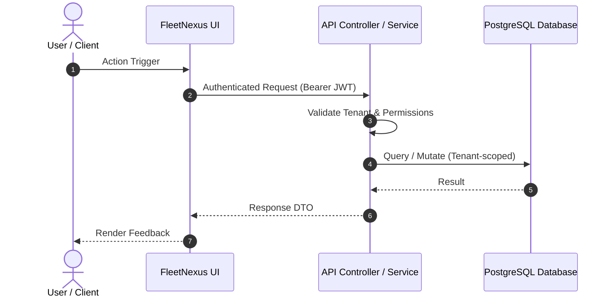

# [FEATURE-ID] — Design: [Feature Title]

> **Status**: `DRAFT` | `READY_FOR_REVIEW` | `APPROVED` | `CHANGES_REQUESTED`  
> **Requirements Baseline**: `[requirements.md](requirements.md)` (Status: `APPROVED`)  
> **Created**: YYYY-MM-DD  
> **Author**: AI Architecture Agent / [Author Name]  
> **Gate 2 Approval**: [ ] Approved by Human (Date: YYYY-MM-DD)

---

## 1. Architectural Context & Objectives

### 1.1 Current Architecture State
*Describe the existing services, entities, and boundaries before this feature.*

### 1.2 Proposed Architecture Overview
*Describe the target state, new abstractions, and how components interact.*

---

## 2. ADR Governance & Pattern Alignment

### 2.1 Active ADR Compliance
| Governing ADR | Area of Impact | How This Feature Adheres |
| :--- | :--- | :--- |
| [ADR-003](../../adr/ADR-003-multi-tenancy-shared-schema.md) | Multi-Tenancy | Applies `TenantId` discriminator column to new entities |
| [ADR-004](../../adr/ADR-004-tenant-isolation-defense-in-depth.md) | Tenant Isolation | Enforces EF Core global query filters + security context |
| [ADR-014](../../adr/ADR-014-soft-delete-and-audit-strategy.md) | Audit & Deletion | Implements `ISoftDeletable` and `IAuditableEntity` |

### 2.2 Novel Architectural Decisions Required?
- [ ] **No new ADR required**: Fits cleanly within existing patterns.
- [ ] **New ADR Proposed**: [ADR-###: Title](../../adr/ADR-###.md) (Drafted with `record-adr` skill).

---

## 3. Component & System Design

### 3.1 Affected Components & Boundaries
- `appfleet-nexus-data`: (New EF entities, DbSets, configuration mappings)
- `appfleet-nexus-security`: (Policy handlers, claim checks)
- `appfleet-nexus-api`: (Controllers, DTOs, service implementations, validators)
- `ui`: (Routes, components, services, state stores)

### 3.2 Data Flow Diagram

---

## 4. Operational & Resiliency Patterns

### 4.1 Failure Handling & Edge Case Strategy
- How invalid states are caught and handled.
- How downstream or database connection issues are surfaced.

### 4.2 Retry, Concurrency & Idempotency
- Concurrency tokens (e.g. `RowVersion` / `xmin`).
- Idempotent request semantics if applicable.

### 4.3 Observability & Telemetry
- Structured log event names and log levels.
- Metric meters and performance counters.

---

## 5. Alternatives Considered & Trade-offs

| Alternative Considered | Rationale for Rejection | Trade-off Accepted |
| :--- | :--- | :--- |
| Option A | ... | ... |
| Option B | ... | ... |
