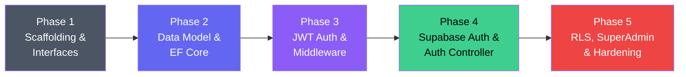

# FleetNexus — Security Implementation Plan

> **Companion document**: [SecurityArchitectureDecision.md](file:///c:/Learn/fleet_solution/app-fleet-nexus-net/docs/SecurityArchitectureDecision.md)  
> **Date**: 2026-06-21  

---

## Overview

This plan implements the FleetNexus security model across **5 phases**. Each phase produces shippable, working code that builds incrementally on the previous phase. The core security infrastructure lives in a dedicated class library (`appfleet-nexus-security`) to keep the architecture clean and reusable.

### Project Structure (Target State)

```
app-fleet-nexus-net/
└── api/
    ├── appfleet-nexus-api/          ← Web API (controllers, Program.cs)
    ├── appfleet-nexus-data/         ← Data layer (EF Core, models, repos)
    ├── appfleet-nexus-security/     ← [NEW] Security library (auth, tenancy, middleware)
    └── Dockerfile
```

### Dependency Graph

```
appfleet-nexus-api
  ├── references → appfleet-nexus-security
  └── references → appfleet-nexus-data

appfleet-nexus-security
  └── references → appfleet-nexus-data  (for DbContext, ITenantContextAccessor)

appfleet-nexus-data
  └── standalone (no project references)
```

---

## PostgreSQL Database Schema

This section defines every table, function, trigger, and RLS policy required for the security model. These are the **minimum database objects** needed. The existing `fmcsa_census` table is untouched.

> [!NOTE]
> Tables in the `public` schema are managed by our application. The `auth.users` table is managed by Supabase Auth — we never modify it directly, but we reference its `id` column.

### Entity-Relationship Diagram

```mermaid
erDiagram
    AUTH_USERS["auth.users (Supabase-managed)"] {
        uuid id PK
        text email
        jsonb raw_user_meta_data
        timestamp created_at
    }

    TENANTS["public.tenants"] {
        uuid id PK
        text name
        timestamp created_date
        boolean is_active
    }

    USERS["public.users"] {
        uuid id PK "FK → auth.users.id"
        text email
        text first_name
        text last_name
        timestamp created_date
        uuid created_by
        uuid modified_by
        timestamp modified_date
        boolean is_deleted
    }

    TENANT_USERS["public.tenant_users"] {
        uuid user_id PK_FK "FK → users.id"
        uuid tenant_id PK_FK "FK → tenants.id"
        text role "Admin or Member"
        boolean is_super_admin
        timestamp joined_date
    }

    CONTACTS["public.contacts"] {
        uuid id PK
        uuid tenant_id FK "FK → tenants.id"
        text first_name
        text last_name
        text primary_email
        text primary_phone
        boolean is_deleted
        uuid created_by
        timestamp created_date
        uuid modified_by
        timestamp modified_date
    }

    VEHICLES["public.vehicles"] {
        uuid id PK
        uuid tenant_id FK "FK → tenants.id"
        text unit_number
        text vin
        text make
        text model
        int year
        text license_plate
        text license_state
        text type
        text status
        boolean is_deleted
        uuid created_by
        timestamp created_date
        uuid modified_by
        timestamp modified_date
    }

    AUTH_USERS ||--|| USERS : "mirrors (via trigger)"
    USERS ||--|| TENANT_USERS : "belongs to"
    TENANTS ||--|{ TENANT_USERS : "has members"
    TENANTS ||--o{ CONTACTS : "owns"
    TENANTS ||--o{ VEHICLES : "owns"
```

---

### Tables

#### `public.tenants` — Organization / Company

```sql
CREATE TABLE public.tenants (
    id              UUID PRIMARY KEY DEFAULT gen_random_uuid(),
    name            TEXT NOT NULL,
    created_date    TIMESTAMPTZ NOT NULL DEFAULT NOW(),
    is_active       BOOLEAN NOT NULL DEFAULT TRUE
);

COMMENT ON TABLE public.tenants IS 'Each tenant represents one fleet company/organization.';
```

#### `public.users` — Application users (mirrors `auth.users`)

```sql
CREATE TABLE public.users (
    id              UUID PRIMARY KEY,                       -- Same as auth.users.id
    email           TEXT NOT NULL,
    first_name      TEXT,
    last_name       TEXT,
    created_date    TIMESTAMPTZ NOT NULL DEFAULT NOW(),

    -- Audit columns
    created_by      UUID,                                   -- NULL on self-signup (user creates themselves)
    modified_by     UUID,
    modified_date   TIMESTAMPTZ,

    -- Soft delete
    is_deleted      BOOLEAN NOT NULL DEFAULT FALSE,

    CONSTRAINT fk_users_auth FOREIGN KEY (id)
        REFERENCES auth.users(id) ON DELETE CASCADE
);

CREATE UNIQUE INDEX idx_users_email ON public.users (email);

COMMENT ON TABLE public.users IS 'Mirrors Supabase auth.users. Synced via DB trigger on signup. Names stored directly here (not on contacts).';
```

#### `public.tenant_users` — User ↔ Tenant membership (with role)

```sql
CREATE TABLE public.tenant_users (
    user_id         UUID NOT NULL,
    tenant_id       UUID NOT NULL,
    role            TEXT NOT NULL DEFAULT 'Member'
                        CHECK (role IN ('Admin', 'Member')),
    is_super_admin  BOOLEAN NOT NULL DEFAULT FALSE,
    joined_date     TIMESTAMPTZ NOT NULL DEFAULT NOW(),

    PRIMARY KEY (user_id, tenant_id),

    CONSTRAINT fk_tu_user FOREIGN KEY (user_id)
        REFERENCES public.users(id) ON DELETE CASCADE,
    CONSTRAINT fk_tu_tenant FOREIGN KEY (tenant_id)
        REFERENCES public.tenants(id) ON DELETE CASCADE
);

-- Enforce single-tenant-per-user (can be dropped later for multi-tenant support)
CREATE UNIQUE INDEX idx_tenant_users_one_tenant_per_user
    ON public.tenant_users (user_id);

COMMENT ON TABLE public.tenant_users IS 'Maps users to tenants with a role. Currently enforces 1 tenant per user via unique index.';
COMMENT ON COLUMN public.tenant_users.is_super_admin IS 'Platform-level admin flag. Set manually for the platform owner.';
```

#### `public.contacts` — Business contacts (customers, vendors, partners)

```sql
CREATE TABLE public.contacts (
    id              UUID PRIMARY KEY DEFAULT gen_random_uuid(),
    tenant_id       UUID NOT NULL,

    -- Domain fields
    first_name      TEXT NOT NULL,
    last_name       TEXT NOT NULL,
    primary_email   TEXT,
    primary_phone   TEXT,

    -- Audit columns
    created_by      UUID NOT NULL,
    created_date    TIMESTAMPTZ NOT NULL DEFAULT NOW(),
    modified_by     UUID,
    modified_date   TIMESTAMPTZ,

    -- Soft delete
    is_deleted      BOOLEAN NOT NULL DEFAULT FALSE,

    CONSTRAINT fk_contacts_tenant FOREIGN KEY (tenant_id)
        REFERENCES public.tenants(id) ON DELETE CASCADE
);

CREATE INDEX idx_contacts_tenant ON public.contacts (tenant_id) WHERE NOT is_deleted;

COMMENT ON TABLE public.contacts IS 'Business contacts (customers, vendors, partners) belonging to a tenant. Separate from users.';
```

#### `public.vehicles` — Tenant-scoped fleet vehicles

```sql
CREATE TABLE public.vehicles (
    id              UUID PRIMARY KEY DEFAULT gen_random_uuid(),
    tenant_id       UUID NOT NULL,

    -- Domain fields
    unit_number     TEXT NOT NULL,
    vin             TEXT,
    make            TEXT,
    model           TEXT,
    year            INT,
    license_plate   TEXT,
    license_state   TEXT,
    type            TEXT,                               -- 'Truck', 'Trailer', etc.
    status          TEXT NOT NULL DEFAULT 'Active',     -- 'Active', 'Inactive', 'Maintenance'

    -- Audit columns
    created_by      UUID NOT NULL,
    created_date    TIMESTAMPTZ NOT NULL DEFAULT NOW(),
    modified_by     UUID,
    modified_date   TIMESTAMPTZ,

    -- Soft delete
    is_deleted      BOOLEAN NOT NULL DEFAULT FALSE,

    CONSTRAINT fk_vehicles_tenant FOREIGN KEY (tenant_id)
        REFERENCES public.tenants(id) ON DELETE CASCADE
);

CREATE INDEX idx_vehicles_tenant ON public.vehicles (tenant_id) WHERE NOT is_deleted;

-- Prevent duplicate unit_number within same tenant (only active records)
CREATE UNIQUE INDEX idx_vehicles_tenant_unit
    ON public.vehicles (tenant_id, unit_number) WHERE NOT is_deleted;

COMMENT ON TABLE public.vehicles IS 'Fleet vehicles belonging to a tenant. Soft-deleted records excluded by EF Core global filter and RLS.';
```

---

### Functions & Triggers

#### Function: `handle_new_user()` — Auto-provision on signup

This is the most critical database function. It fires every time a new user signs up via Supabase Auth and atomically creates the necessary rows in the `public` schema.

```sql
CREATE OR REPLACE FUNCTION public.handle_new_user()
RETURNS TRIGGER
LANGUAGE plpgsql
SECURITY DEFINER                    -- Runs with table owner privileges
SET search_path = public            -- Prevent search_path injection
AS $$
DECLARE
    v_tenant_id     UUID;
    v_first_name    TEXT;
    v_last_name     TEXT;
BEGIN
    -- ─── Extract metadata from Supabase signup payload ───
    v_first_name := NEW.raw_user_meta_data ->> 'first_name';
    v_last_name  := NEW.raw_user_meta_data ->> 'last_name';

    -- Fallback: use email prefix if no name provided
    IF v_first_name IS NULL OR v_first_name = '' THEN
        v_first_name := split_part(NEW.email, '@', 1);
    END IF;

    -- ─── 1. Create public.users row (mirrors auth.users) ───
    INSERT INTO public.users (id, email, first_name, last_name, created_date)
    VALUES (NEW.id, NEW.email, v_first_name, v_last_name, NOW());

    -- ─── 2. Create a new tenant ───
    v_tenant_id := gen_random_uuid();
    INSERT INTO public.tenants (id, name, created_date, is_active)
    VALUES (v_tenant_id, COALESCE(v_first_name, '') || '''s Organization', NOW(), TRUE);

    -- ─── 3. Link user to tenant as Admin ───
    INSERT INTO public.tenant_users (user_id, tenant_id, role, is_super_admin, joined_date)
    VALUES (NEW.id, v_tenant_id, 'Admin', FALSE, NOW());

    RETURN NEW;
END;
$$;

COMMENT ON FUNCTION public.handle_new_user() IS
    'Auto-provisions public.users + tenant + membership when a new user signs up via Supabase Auth.';
```

> [!NOTE]
> This trigger handles **self-service signup only** (MVP). When the invitation system is added post-MVP, this function will be extended to check for `invited_tenant_id` in `raw_user_meta_data` and skip tenant creation when present.

#### Trigger: `on_auth_user_created`

```sql
DROP TRIGGER IF EXISTS on_auth_user_created ON auth.users;

CREATE TRIGGER on_auth_user_created
    AFTER INSERT ON auth.users
    FOR EACH ROW
    EXECUTE FUNCTION public.handle_new_user();

COMMENT ON TRIGGER on_auth_user_created ON auth.users IS
    'Fires after Supabase Auth creates a new user. Calls handle_new_user() to provision app-level records.';
```

---

### Row-Level Security (RLS) Policies

RLS is the database-level safety net. Even if the application code has a bug that bypasses EF Core Global Query Filters, these policies prevent cross-tenant data access at the PostgreSQL level.

#### How it works

1. The .NET API's `TenantMiddleware` (or `RlsConnectionInterceptor`) sets a session variable on every DB connection:
   ```sql
   SET LOCAL app.current_tenant_id = '<tenant-uuid>';
   ```
2. RLS policies check this variable on every `SELECT`, `INSERT`, `UPDATE`, `DELETE`.
3. `SET LOCAL` is transaction-scoped — it auto-resets when the transaction ends, preventing tenant leakage between requests.

#### Enable RLS on tenant-scoped tables

```sql
-- Enable RLS
ALTER TABLE public.contacts ENABLE ROW LEVEL SECURITY;
ALTER TABLE public.vehicles ENABLE ROW LEVEL SECURITY;

-- IMPORTANT: Force RLS on the table owner too (our API connects as this role)
ALTER TABLE public.contacts FORCE ROW LEVEL SECURITY;
ALTER TABLE public.vehicles FORCE ROW LEVEL SECURITY;
```

> [!WARNING]
> `ENABLE ROW LEVEL SECURITY` alone does NOT apply policies to the table owner. Since the API connects as the table owner (`postgres` role in Supabase), you MUST also call `FORCE ROW LEVEL SECURITY` or the policies are silently bypassed.

#### Tenant isolation policies

```sql
-- ─── CONTACTS ───
CREATE POLICY tenant_isolation_select ON public.contacts
    FOR SELECT USING (
        tenant_id::text = current_setting('app.current_tenant_id', true)
        OR current_setting('app.is_super_admin', true) = 'true'
    );

CREATE POLICY tenant_isolation_insert ON public.contacts
    FOR INSERT WITH CHECK (
        tenant_id::text = current_setting('app.current_tenant_id', true)
        OR current_setting('app.is_super_admin', true) = 'true'
    );

CREATE POLICY tenant_isolation_update ON public.contacts
    FOR UPDATE USING (
        tenant_id::text = current_setting('app.current_tenant_id', true)
        OR current_setting('app.is_super_admin', true) = 'true'
    );

CREATE POLICY tenant_isolation_delete ON public.contacts
    FOR DELETE USING (
        tenant_id::text = current_setting('app.current_tenant_id', true)
        OR current_setting('app.is_super_admin', true) = 'true'
    );

-- ─── VEHICLES ───
CREATE POLICY tenant_isolation_select ON public.vehicles
    FOR SELECT USING (
        tenant_id::text = current_setting('app.current_tenant_id', true)
        OR current_setting('app.is_super_admin', true) = 'true'
    );

CREATE POLICY tenant_isolation_insert ON public.vehicles
    FOR INSERT WITH CHECK (
        tenant_id::text = current_setting('app.current_tenant_id', true)
        OR current_setting('app.is_super_admin', true) = 'true'
    );

CREATE POLICY tenant_isolation_update ON public.vehicles
    FOR UPDATE USING (
        tenant_id::text = current_setting('app.current_tenant_id', true)
        OR current_setting('app.is_super_admin', true) = 'true'
    );

CREATE POLICY tenant_isolation_delete ON public.vehicles
    FOR DELETE USING (
        tenant_id::text = current_setting('app.current_tenant_id', true)
        OR current_setting('app.is_super_admin', true) = 'true'
    );
```

---

### Summary: Minimum Database Objects

| Type | Name | Purpose |
|------|------|---------|
| **Table** | `public.tenants` | Stores tenant (organization) records |
| **Table** | `public.users` | Mirrors `auth.users` with first/last name, audit columns, soft delete |
| **Table** | `public.tenant_users` | Maps users to tenants with roles + SuperAdmin flag |
| **Table** | `public.contacts` | Tenant-scoped business contacts (customers, vendors) |
| **Table** | `public.vehicles` | Tenant-scoped fleet vehicles |
| **Function** | `public.handle_new_user()` | Auto-provisions user + tenant on Supabase signup |
| **Trigger** | `on_auth_user_created` | Fires `handle_new_user()` after `auth.users` INSERT |
| **RLS Policies** | `tenant_isolation_*` (×8) | SELECT/INSERT/UPDATE/DELETE per tenant-scoped table |
| **Indexes** | 4 indexes | Performance + uniqueness constraints |

> [!TIP]
> All SQL above can be run as a single script in the **Supabase SQL Editor** (Dashboard → SQL Editor → New query). Run the tables first, then functions/triggers, then RLS policies.

---

## Phase 1: Scaffolding & Interfaces

**Goal**: Create the `appfleet-nexus-security` project, define all interfaces and abstractions, and stub out every class. No real logic yet — just the skeleton that all subsequent phases will fill in.

**Shippable outcome**: Solution compiles. No runtime behavior changes. Existing FMCSA endpoints continue to work.

---

### Step 1.1 — Create the `appfleet-nexus-security` class library

```bash
# From the api/ directory
dotnet new classlib -n appfleet-nexus-security -f net10.0
```

Add project references:

```xml
<!-- appfleet-nexus-security.csproj -->
<ItemGroup>
  <ProjectReference Include="..\appfleet-nexus-data\appfleet-nexus-data.csproj" />
</ItemGroup>

<ItemGroup>
  <PackageReference Include="Microsoft.AspNetCore.Authentication.JwtBearer" Version="10.0.*" />
  <PackageReference Include="Microsoft.EntityFrameworkCore" Version="9.0.*" />
</ItemGroup>
```

```xml
<!-- appfleet-nexus-api.csproj — add reference to security project -->
<ItemGroup>
  <ProjectReference Include="..\appfleet-nexus-security\appfleet-nexus-security.csproj" />
</ItemGroup>
```

### Step 1.2 — Define folder structure inside `appfleet-nexus-security`

```
appfleet-nexus-security/
├── Tenancy/
│   ├── ITenantContext.cs              ← Interface: current user + tenant + role
│   ├── TenantContext.cs               ← Scoped implementation (mutable, set by middleware)
│   ├── TenantMiddleware.cs            ← ASP.NET middleware: resolves tenant from JWT claims
│   └── RlsConnectionInterceptor.cs   ← EF Core interceptor: SET LOCAL on DB connection
├── Authentication/
│   ├── ISupabaseAuthService.cs        ← Interface: signup, login, refresh
│   ├── SupabaseAuthService.cs         ← Supabase Auth REST API client
│   ├── SupabaseOptions.cs             ← Configuration POCO (Url, AnonKey, ServiceRoleKey, JwtSecret)
│   └── AuthDtos.cs                    ← Request/Response DTOs (SignupRequest, LoginRequest, AuthResponse)
├── Authorization/
│   ├── Roles.cs                       ← Constants: "Admin", "Member", "SuperAdmin"
│   └── SuperAdminRequirement.cs       ← Custom IAuthorizationRequirement for platform admin
├── Extensions/
│   └── SecurityServiceExtensions.cs   ← IServiceCollection.AddFleetNexusSecurity() extension
└── appfleet-nexus-security.csproj
```

### Step 1.3 — Define all interfaces (stubbed)

#### `ITenantContext.cs`

```csharp
namespace AppFleetNexus.Security.Tenancy;

/// <summary>
/// Provides the current request's tenant and user context.
/// Populated by TenantMiddleware after JWT authentication.
/// </summary>
public interface ITenantContext
{
    Guid UserId { get; }
    Guid TenantId { get; }
    string Role { get; }
    bool IsSuperAdmin { get; }
}
```

#### `ISupabaseAuthService.cs`

```csharp
namespace AppFleetNexus.Security.Authentication;

public interface ISupabaseAuthService
{
    Task<AuthResponse> SignUpAsync(SignupRequest request);
    Task<AuthResponse> SignInAsync(LoginRequest request);
    Task<AuthResponse> RefreshTokenAsync(string refreshToken);
}
```

#### `Roles.cs`

```csharp
namespace AppFleetNexus.Security.Authorization;

public static class Roles
{
    public const string Admin = "Admin";
    public const string Member = "Member";
    public const string SuperAdmin = "SuperAdmin";
}
```

#### `SecurityServiceExtensions.cs` (stub)

```csharp
namespace AppFleetNexus.Security.Extensions;

public static class SecurityServiceExtensions
{
    /// <summary>
    /// Registers all FleetNexus security services: JWT auth, tenant context, Supabase client.
    /// </summary>
    public static IServiceCollection AddFleetNexusSecurity(
        this IServiceCollection services, IConfiguration configuration)
    {
        // Phase 3 will fill this in
        return services;
    }

    /// <summary>
    /// Adds security middleware to the pipeline (must be called after UseAuthentication).
    /// </summary>
    public static IApplicationBuilder UseFleetNexusSecurity(this IApplicationBuilder app)
    {
        // Phase 3 will fill this in
        return app;
    }
}
```

### Step 1.4 — Stub `Program.cs` integration point

Add a placeholder call in `Program.cs` that compiles but does nothing yet:

```csharp
// Program.cs — after builder.Services.AddControllers()
builder.Services.AddFleetNexusSecurity(builder.Configuration);

// ... after app.UseCors(...)
app.UseFleetNexusSecurity();
```

### Step 1.5 — Verify

```bash
dotnet build
```

✅ **Phase 1 complete**: Solution compiles. Security library exists with interfaces. No behavior changes. FMCSA endpoints still work.

---

## Phase 2: Data Model & EF Core Multi-Tenancy

**Goal**: Create the tenant-aware data model (`BaseEntity`, `Tenant`, `User`, `TenantUser`, `Contact`, `Vehicle`), configure EF Core Global Query Filters, and implement the `SaveChanges` audit-column override.

**Shippable outcome**: Database schema is created. EF Core automatically filters queries by `TenantId` and populates audit columns. Soft delete works transparently.

---

### Step 2.1 — Create `BaseEntity` in `appfleet-nexus-data`

```csharp
// appfleet-nexus-data/Models/BaseEntity.cs
namespace AppFleetNexus.Data.Models;

/// <summary>
/// Base class for all tenant-scoped entities.
/// Provides tenant isolation, audit columns, and soft delete.
/// </summary>
public abstract class BaseEntity
{
    public Guid Id { get; set; }
    public Guid TenantId { get; set; }

    // Audit
    public Guid CreatedBy { get; set; }
    public DateTime CreatedDate { get; set; }
    public Guid? ModifiedBy { get; set; }
    public DateTime? ModifiedDate { get; set; }

    // Soft Delete
    public bool IsDeleted { get; set; }
}
```

### Step 2.2 — Create new entity models

Create the following models in `appfleet-nexus-data/Models/`:

| File | Inherits | Tenant-scoped? | Notes |
|------|----------|---------------|-------|
| `Tenant.cs` | — | No (it IS the tenant) | `Id`, `Name`, `CreatedDate`, `IsActive` |
| `User.cs` | — | No (mirrors `auth.users`) | `Id` (= Supabase UID), `Email`, `FirstName`, `LastName`, audit columns, `IsDeleted` |
| `TenantUser.cs` | — | No (join table) | Composite key `(UserId, TenantId)`, `Role`, `JoinedDate`, `IsSuperAdmin` |
| `Contact.cs` | `BaseEntity` | ✅ Yes | `FirstName`, `LastName`, `PrimaryEmail`, `PrimaryPhone` |
| `Vehicle.cs` | `BaseEntity` | ✅ Yes | `UnitNumber`, `Vin`, `Make`, `Model`, `Year`, `LicensePlate`, `LicenseState`, `Type`, `Status` |

#### `Tenant.cs`

```csharp
public class Tenant
{
    public Guid Id { get; set; }
    public string Name { get; set; } = string.Empty;
    public DateTime CreatedDate { get; set; }
    public bool IsActive { get; set; } = true;

    // Navigation
    public ICollection<TenantUser> TenantUsers { get; set; } = [];
}
```

#### `User.cs`

```csharp
public class User
{
    public Guid Id { get; set; }           // Same as auth.users.id
    public string Email { get; set; } = string.Empty;
    public string? FirstName { get; set; }
    public string? LastName { get; set; }
    public DateTime CreatedDate { get; set; }

    // Audit
    public Guid? CreatedBy { get; set; }   // NULL on self-signup
    public Guid? ModifiedBy { get; set; }
    public DateTime? ModifiedDate { get; set; }

    // Soft Delete
    public bool IsDeleted { get; set; }

    // Navigation
    public ICollection<TenantUser> TenantUsers { get; set; } = [];
}
```

#### `TenantUser.cs`

```csharp
public class TenantUser
{
    public Guid UserId { get; set; }
    public Guid TenantId { get; set; }
    public string Role { get; set; } = "Member";   // "Admin" or "Member"
    public bool IsSuperAdmin { get; set; }
    public DateTime JoinedDate { get; set; }

    // Navigation
    public User User { get; set; } = null!;
    public Tenant Tenant { get; set; } = null!;
}
```

#### `Contact.cs`

```csharp
public class Contact : BaseEntity
{
    public string FirstName { get; set; } = string.Empty;
    public string LastName { get; set; } = string.Empty;
    public string? PrimaryEmail { get; set; }
    public string? PrimaryPhone { get; set; }
}
```

#### `Vehicle.cs`

```csharp
public class Vehicle : BaseEntity
{
    public string UnitNumber { get; set; } = string.Empty;
    public string? Vin { get; set; }
    public string? Make { get; set; }
    public string? Model { get; set; }
    public int? Year { get; set; }
    public string? LicensePlate { get; set; }
    public string? LicenseState { get; set; }
    public string? Type { get; set; }          // "Truck", "Trailer", etc.
    public string? Status { get; set; }        // "Active", "Inactive", "Maintenance"
}
```

> **Note on `Carrier`**: The existing `Carrier.cs` and `CarrierSummary.cs` models remain unchanged. They do not participate in the multi-tenancy model.

### Step 2.3 — Create `ITenantContextAccessor` in `appfleet-nexus-data`

The data project needs to access the current tenant without depending on the security project. Define a minimal interface:

```csharp
// appfleet-nexus-data/Tenancy/ITenantContextAccessor.cs
namespace AppFleetNexus.Data.Tenancy;

/// <summary>
/// Provides the current tenant and user IDs to the data layer.
/// Implemented by the security library's TenantContext.
/// </summary>
public interface ITenantContextAccessor
{
    Guid CurrentUserId { get; }
    Guid CurrentTenantId { get; }
}
```

### Step 2.4 — Update `FleetNexusDbContext`

Major changes:

1. **Add new `DbSet` properties** for all new entities
2. **Inject `ITenantContextAccessor`** (from the data project) for global query filters
3. **Configure Global Query Filters** on all `BaseEntity`-derived entities: `WHERE TenantId = @current AND IsDeleted = false`
4. **Override `SaveChangesAsync`** to auto-populate audit columns and convert hard deletes to soft deletes
5. **Keep the existing `Carrier` DbSet** unchanged — no filters, no audit columns

```csharp
public class FleetNexusDbContext : DbContext
{
    private readonly ITenantContextAccessor _tenantAccessor;

    public FleetNexusDbContext(
        DbContextOptions<FleetNexusDbContext> options,
        ITenantContextAccessor tenantAccessor) : base(options)
    {
        _tenantAccessor = tenantAccessor;
    }

    // Existing
    public DbSet<Carrier> Carriers { get; set; }

    // New
    public DbSet<Tenant> Tenants { get; set; }
    public DbSet<User> Users { get; set; }
    public DbSet<TenantUser> TenantUsers { get; set; }
    public DbSet<Contact> Contacts { get; set; }
    public DbSet<Vehicle> Vehicles { get; set; }

    protected override void OnModelCreating(ModelBuilder modelBuilder)
    {
        base.OnModelCreating(modelBuilder);

        // Existing Carrier config (unchanged)
        modelBuilder.Entity<Carrier>(entity =>
        {
            entity.ToTable("fmcsa_census");
            entity.HasKey(e => e.DotNumber);
        });

        // Composite key for TenantUser
        modelBuilder.Entity<TenantUser>()
            .HasKey(tu => new { tu.UserId, tu.TenantId });

        // Global query filters for tenant isolation + soft delete
        modelBuilder.Entity<Contact>()
            .HasQueryFilter(e => e.TenantId == _tenantAccessor.CurrentTenantId && !e.IsDeleted);
        modelBuilder.Entity<Vehicle>()
            .HasQueryFilter(e => e.TenantId == _tenantAccessor.CurrentTenantId && !e.IsDeleted);
    }

    public override Task<int> SaveChangesAsync(CancellationToken ct = default)
    {
        ApplyAuditInfo();
        return base.SaveChangesAsync(ct);
    }

    private void ApplyAuditInfo()
    {
        var entries = ChangeTracker.Entries<BaseEntity>();
        var now = DateTime.UtcNow;
        var userId = _tenantAccessor.CurrentUserId;
        var tenantId = _tenantAccessor.CurrentTenantId;

        foreach (var entry in entries)
        {
            switch (entry.State)
            {
                case EntityState.Added:
                    entry.Entity.TenantId = tenantId;
                    entry.Entity.CreatedBy = userId;
                    entry.Entity.CreatedDate = now;
                    break;
                case EntityState.Modified:
                    entry.Entity.ModifiedBy = userId;
                    entry.Entity.ModifiedDate = now;
                    break;
                case EntityState.Deleted:
                    // Convert hard delete to soft delete
                    entry.State = EntityState.Modified;
                    entry.Entity.IsDeleted = true;
                    entry.Entity.ModifiedBy = userId;
                    entry.Entity.ModifiedDate = now;
                    break;
            }
        }
    }
}
```

### Step 2.5 — Create EF Core Migration

```bash
dotnet ef migrations add MultiTenantSecurityModel --project appfleet-nexus-data --startup-project appfleet-nexus-api
dotnet ef database update --project appfleet-nexus-data --startup-project appfleet-nexus-api
```

### Step 2.6 — Verify

- `dotnet build` compiles
- Migration creates new tables alongside existing `fmcsa_census`
- Existing `CarriersController` still works (no filters applied to `Carrier`)

✅ **Phase 2 complete**: Schema is live. EF Core filters and audit columns are active. No auth yet — tenant context defaults to empty GUID.

---

## Phase 3: JWT Authentication & Tenant Resolution Middleware

**Goal**: Implement the full JWT validation pipeline and tenant resolution middleware. After this phase, the API can authenticate users and resolve their tenant context from every request.

**Shippable outcome**: API rejects unauthenticated requests (except `[AllowAnonymous]`). Authenticated requests carry a valid tenant context. CORS is locked down.

---

### Step 3.1 — Implement `SupabaseOptions`

```csharp
// appfleet-nexus-security/Authentication/SupabaseOptions.cs
namespace AppFleetNexus.Security.Authentication;

public class SupabaseOptions
{
    public const string SectionName = "Supabase";

    public string Url { get; set; } = string.Empty;
    public string AnonKey { get; set; } = string.Empty;
    public string ServiceRoleKey { get; set; } = string.Empty;
    public string JwtSecret { get; set; } = string.Empty;
}
```

### Step 3.2 — Implement `TenantContext` (scoped service)

```csharp
// appfleet-nexus-security/Tenancy/TenantContext.cs
// Implements both ITenantContext (from security) and ITenantContextAccessor (from data)
public class TenantContext : ITenantContext, ITenantContextAccessor
{
    public Guid UserId { get; set; }
    public Guid TenantId { get; set; }
    public string Role { get; set; } = string.Empty;
    public bool IsSuperAdmin { get; set; }

    // ITenantContextAccessor
    Guid ITenantContextAccessor.CurrentUserId => UserId;
    Guid ITenantContextAccessor.CurrentTenantId => TenantId;
}
```

### Step 3.3 — Implement `TenantMiddleware`

```csharp
// appfleet-nexus-security/Tenancy/TenantMiddleware.cs
// For each authenticated request:
// 1. Extract `sub` claim (Supabase user ID) from JWT
// 2. Query `tenant_users` (bypassing global filters) to find membership
// 3. Populate TenantContext with UserId, TenantId, Role, IsSuperAdmin
// 4. Execute SET LOCAL app.current_tenant_id for RLS
// 5. If IsSuperAdmin, also SET LOCAL app.is_super_admin = 'true'
// 6. Call next middleware
```

### Step 3.4 — Implement `RlsConnectionInterceptor`

```csharp
// appfleet-nexus-security/Tenancy/RlsConnectionInterceptor.cs
// EF Core DbConnectionInterceptor
// On ConnectionOpenedAsync:
//   If TenantContext has a TenantId, execute:
//     SET LOCAL app.current_tenant_id = '<tenant-id>'
//   If IsSuperAdmin, also execute:
//     SET LOCAL app.is_super_admin = 'true'
```

### Step 3.5 — Implement `SecurityServiceExtensions` (full)

```csharp
// appfleet-nexus-security/Extensions/SecurityServiceExtensions.cs

public static IServiceCollection AddFleetNexusSecurity(
    this IServiceCollection services, IConfiguration configuration)
{
    // 1. Bind SupabaseOptions from config
    services.Configure<SupabaseOptions>(configuration.GetSection(SupabaseOptions.SectionName));

    // 2. Register JWT Bearer authentication
    services.AddAuthentication(JwtBearerDefaults.AuthenticationScheme)
        .AddJwtBearer(options =>
        {
            var supabaseConfig = configuration.GetSection(SupabaseOptions.SectionName)
                .Get<SupabaseOptions>()!;
            options.TokenValidationParameters = new TokenValidationParameters
            {
                ValidateIssuer = true,
                ValidIssuer = $"{supabaseConfig.Url}/auth/v1",
                ValidateAudience = true,
                ValidAudience = "authenticated",
                ValidateIssuerSigningKey = true,
                IssuerSigningKey = new SymmetricSecurityKey(
                    Encoding.UTF8.GetBytes(supabaseConfig.JwtSecret)),
                ValidateLifetime = true,
            };
        });

    // 3. Default-deny authorization policy
    services.AddAuthorization(options =>
    {
        options.FallbackPolicy = new AuthorizationPolicyBuilder()
            .RequireAuthenticatedUser()
            .Build();
    });

    // 4. Register scoped TenantContext (implements both interfaces)
    services.AddScoped<TenantContext>();
    services.AddScoped<ITenantContext>(sp => sp.GetRequiredService<TenantContext>());
    services.AddScoped<ITenantContextAccessor>(sp => sp.GetRequiredService<TenantContext>());

    // 5. Register RLS interceptor
    services.AddScoped<RlsConnectionInterceptor>();

    // 6. Register Supabase auth service
    services.AddHttpClient<ISupabaseAuthService, SupabaseAuthService>();

    return services;
}

public static IApplicationBuilder UseFleetNexusSecurity(this IApplicationBuilder app)
{
    app.UseAuthentication();
    app.UseAuthorization();
    app.UseMiddleware<TenantMiddleware>();
    return app;
}
```

### Step 3.6 — Update `Program.cs`

Simplify `Program.cs` to delegate to the security library:

```csharp
// BEFORE (existing)
app.UseCors("AllowBlazor");
app.MapControllers();

// AFTER
app.UseCors("AllowBlazor");
app.UseFleetNexusSecurity();    // auth + authorization + tenant middleware
app.MapControllers();
```

Lock down CORS:

```csharp
builder.Services.AddCors(options =>
{
    options.AddPolicy("AllowBlazor", policy =>
    {
        policy.WithOrigins(
                "https://fleetnexus.io",
                "https://www.fleetnexus.io",
                "https://localhost:7001"   // local dev
            )
            .AllowAnyMethod()
            .AllowAnyHeader()
            .AllowCredentials();
    });
});
```

### Step 3.7 — Mark existing endpoints

```csharp
// HealthController.cs — add [AllowAnonymous]
[AllowAnonymous]
[ApiController]
[Route("api/health")]
public class HealthController : ControllerBase { ... }

// CarriersController.cs — add [AllowAnonymous] (public FMCSA data, no auth needed)
[AllowAnonymous]
[ApiController]
[Route("api/carriers")]
public class CarriersController : ControllerBase { ... }
```

### Step 3.8 — Add config sections

```json
// appsettings.json
{
  "Supabase": {
    "Url": "https://<your-project>.supabase.co",
    "AnonKey": "<from-supabase-dashboard>",
    "ServiceRoleKey": "<from-supabase-dashboard>",
    "JwtSecret": "<from-supabase-dashboard>"
  }
}
```

> ⚠️ **Important**: `ServiceRoleKey` and `JwtSecret` must ONLY be in `appsettings.Local.json` (gitignored) for local dev, and in Render environment variables for production.

### Step 3.9 — Verify

- `dotnet build` compiles
- Unauthenticated call to `GET /api/health` → 200 OK
- Unauthenticated call to `GET /api/carriers/top` → 200 OK (AllowAnonymous)
- Unauthenticated call to any future secured endpoint → 401 Unauthorized

✅ **Phase 3 complete**: JWT auth pipeline is live. Tenant resolution works. CORS is locked down. Existing public endpoints unaffected.

---

## Phase 4: Supabase Auth Service & Auth Controller

**Goal**: Implement the `SupabaseAuthService` that wraps the Supabase Auth REST API, and create the `AuthController` with signup, login, refresh, and logout endpoints.

**Shippable outcome**: Users can sign up, log in, and receive JWTs. The DB trigger auto-provisions tenants on signup.

---

### Step 4.1 — Implement `AuthDtos.cs`

```csharp
// DTOs for auth request/response:

public record SignupRequest(string Email, string Password, string? FirstName, string? LastName);
public record LoginRequest(string Email, string Password);
public record RefreshRequest(string RefreshToken);
public record AuthResponse(string AccessToken, string RefreshToken, Guid UserId, string Email);
```

### Step 4.2 — Implement `SupabaseAuthService`

HTTP client that calls Supabase Auth REST endpoints:

| Method | Supabase Endpoint | HTTP Method | Auth Header |
|--------|-------------------|-------------|-------------|
| `SignUpAsync` | `/auth/v1/signup` | POST | `apikey: <anon_key>` |
| `SignInAsync` | `/auth/v1/token?grant_type=password` | POST | `apikey: <anon_key>` |
| `RefreshTokenAsync` | `/auth/v1/token?grant_type=refresh_token` | POST | `apikey: <anon_key>` |

For signup, the service passes `first_name` and `last_name` in `raw_user_meta_data` so the DB trigger can use them for the user and tenant name.

### Step 4.3 — Create `AuthController`

```csharp
// appfleet-nexus-api/Controllers/AuthController.cs

[AllowAnonymous]
[ApiController]
[Route("api/auth")]
public class AuthController : ControllerBase
{
    [HttpPost("signup")]    // → SupabaseAuthService.SignUpAsync()
    [HttpPost("login")]     // → SupabaseAuthService.SignInAsync()
    [HttpPost("refresh")]   // → SupabaseAuthService.RefreshTokenAsync()
    [HttpPost("logout")]    // → Client discards tokens (stateless)
}
```

### Step 4.4 — Create Supabase DB Trigger (SQL)

Execute the `handle_new_user()` function and `on_auth_user_created` trigger from the [PostgreSQL Database Schema](#functions--triggers) section above in the Supabase SQL Editor.

### Step 4.5 — Verify

- `POST /api/auth/signup` → User created in `auth.users`, `public.users`, `public.tenants`, `public.tenant_users`
- `POST /api/auth/login` → Returns JWT with `sub` = user ID
- JWT can be used to call secured endpoints
- User's `first_name` and `last_name` stored correctly on `public.users`

✅ **Phase 4 complete**: Full auth flow works. Users can sign up and log in. Tenants are auto-provisioned.

---

## Phase 5: PostgreSQL RLS, SuperAdmin, & Hardening

**Goal**: Add the database-level safety net (RLS policies), implement the SuperAdmin role, and harden the overall security posture.

**Shippable outcome**: Defense-in-depth tenant isolation is active. Platform owner can access all tenants for support. CORS, error handling, and logging are production-ready.

---

### Step 5.1 — Create RLS policies (SQL)

Execute the RLS policy SQL from the [PostgreSQL Database Schema](#row-level-security-rls-policies) section above in the Supabase SQL Editor.

### Step 5.2 — Implement SuperAdmin

#### SuperAdmin identification

In `tenant_users`, the `is_super_admin` boolean is set manually in the database for the platform owner's account:

```sql
UPDATE public.tenant_users
SET is_super_admin = TRUE
WHERE user_id = '<your-user-uuid>';
```

#### SuperAdmin authorization handler

```csharp
// appfleet-nexus-security/Authorization/SuperAdminRequirement.cs

public class SuperAdminRequirement : IAuthorizationRequirement { }

public class SuperAdminHandler : AuthorizationHandler<SuperAdminRequirement>
{
    private readonly ITenantContext _tenantContext;

    protected override Task HandleRequirementAsync(
        AuthorizationHandlerContext context, SuperAdminRequirement requirement)
    {
        if (_tenantContext.IsSuperAdmin)
            context.Succeed(requirement);
        return Task.CompletedTask;
    }
}
```

#### SuperAdmin middleware behavior

When `IsSuperAdmin = true` in `TenantMiddleware`:

- If request has an `X-Tenant-Id` header → set that as the active tenant (allows impersonation for support)
- If no header → set the SuperAdmin's own tenant as active
- Set `app.is_super_admin = 'true'` on the DB connection so RLS policies allow cross-tenant access

#### SuperAdmin controller

```csharp
// appfleet-nexus-api/Controllers/AdminController.cs

[ApiController]
[Route("api/admin")]
[Authorize(Policy = "SuperAdmin")]
public class AdminController : ControllerBase
{
    [HttpGet("tenants")]          // List all tenants
    [HttpGet("tenants/{id}")]     // Get tenant details + user count
    [HttpGet("users")]            // List all users across tenants
}
```

### Step 5.3 — Hardening checklist

| Item | Action | Location |
|------|--------|----------|
| **Error responses** | Never leak stack traces in production. Return generic error messages. | Global exception handler middleware |
| **CORS** | Verify only whitelisted origins in prod | `Program.cs` |
| **HTTPS** | Enforce HTTPS redirect | Already in `Program.cs` |
| **Security headers** | Add `X-Content-Type-Options`, `X-Frame-Options`, `Strict-Transport-Security` | Custom middleware or Render config |
| **Input validation** | Use `[Required]`, `[MaxLength]`, FluentValidation on all DTOs | All controllers |
| **Logging** | Log auth failures and tenant resolution failures (with Serilog) | `TenantMiddleware` |
| **Token expiry** | Verify JWTs expire appropriately (Supabase default: 1 hour) | Supabase dashboard config |

### Step 5.4 — Verify

- **RLS test**: Connect to DB directly (e.g., via psql) without setting `app.current_tenant_id` → `SELECT * FROM contacts` returns 0 rows
- **SuperAdmin test**: Login as SuperAdmin → can list all tenants → can set `X-Tenant-Id` header and see another tenant's data
- **Security headers**: Check response headers in browser DevTools
- **Error handling**: Trigger a 500 error → verify no stack trace in response body

✅ **Phase 5 complete**: Security model fully implemented with defense-in-depth.

---

## Nice-to-Have (Post-MVP)

These features are deferred from the MVP but the architecture supports adding them without breaking changes.

### Invitation System

**Effort**: ~4-6 hours

1. Add `invitations` table (`token`, `tenant_id`, `role`, `invited_by`, `expires_at`, `is_redeemed`)
2. Add `InvitationsController` (create, validate, revoke, list)
3. Update `handle_new_user()` trigger to check for `invited_tenant_id` in user metadata
4. Update `AuthController.SignUp` to accept an optional `invite_token`
5. Add RLS policies on the `invitations` table

### Full Audit History

**Effort**: ~6-8 hours

1. Create a shared `audit_log` table: `entity_type`, `entity_id`, `action` (Create/Update/Delete), `changed_by`, `changed_at`, `old_values` (JSONB), `new_values` (JSONB)
2. Implement via EF Core `SaveChanges` interceptor or PostgreSQL triggers
3. Captures who deleted what and when (replaces the need for `deleted_at`/`deleted_by` columns)

---

## Summary: Phase Dependencies



| Phase | Deliverable | Estimated Effort |
|-------|------------|------------------|
| 1. Scaffolding | Security project + interfaces + stubs | ~1 hour |
| 2. Data Model | Entities + DbContext + migration | ~2 hours |
| 3. JWT + Middleware | Auth pipeline + tenant resolution | ~3 hours |
| 4. Auth Service | Supabase integration + auth endpoints + DB trigger | ~3 hours |
| 5. RLS + SuperAdmin + Hardening | DB policies + admin endpoints + security headers | ~3 hours |
| **Total** | | **~12 hours** |

---

## Configuration Checklist

Before starting implementation, gather these values:

- [ ] Supabase Project URL (`https://<project>.supabase.co`)
- [ ] Supabase Anon Key
- [ ] Supabase Service Role Key
- [ ] Supabase JWT Secret
- [ ] PostgreSQL connection string (already have this)
- [ ] Blazor UI local dev URL + port
- [ ] Production domain(s) for CORS whitelist
