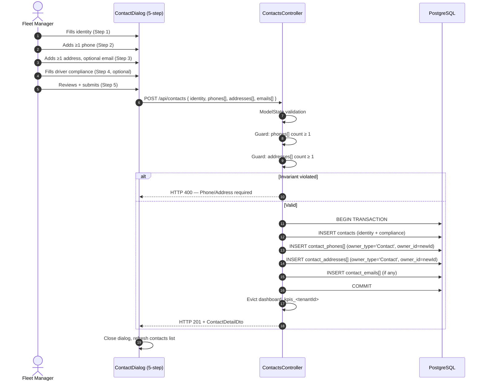
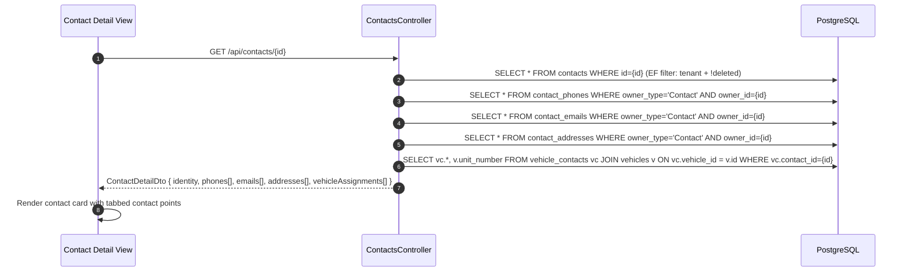
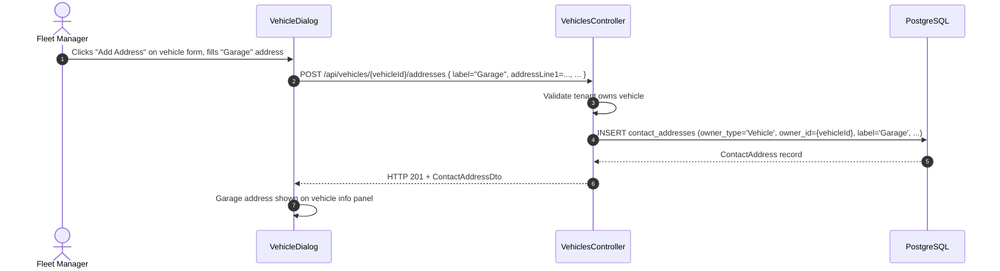

# FEATURE-001 — Design: Contact Management & Vehicle Associations

> **Status**: `APPROVED` *(v3 — Separate Typed Contact Point Tables)*  
> **Requirements Baseline**: [requirements.md](requirements.md) (Status: `APPROVED`, Amendment v2)  
> **Created**: 2026-09-19  
> **Author**: AI Architecture Agent  
> **Gate 2 Approval**: [x] Approved by Human (Date: 2026-09-19)

---

## 1. Architectural Context & Objectives

### 1.1 Current Architecture State

The platform currently has a `public.contacts` table with minimal fields (`first_name`, `last_name`, `primary_email`, `primary_phone`) and a `Contact` EF Core entity extending `BaseEntity`. The Contacts tab in `Inventory.razor` is a "Coming Soon" placeholder with no working UI, API endpoints, or data flow. There is no association model linking contacts to vehicles, and no structured contact point infrastructure.

Vehicles are fully implemented with an established pattern (`public.vehicles`, `VehiclesController`, `VehicleDialog.razor`, `VehicleDto`) that the contact feature will mirror and extend.

### 1.2 Proposed Architecture Overview (Target State)

Five entity types form the complete domain:

| Entity | Type | Purpose |
|:---|:---|:---|
| `Contact` | **Extended** | Identity record for a person (driver, manager, vendor, etc.) |
| `ContactPhone` | **NEW** | Phone number(s) owned by a Contact or Vehicle |
| `ContactEmail` | **NEW** | Email address(es) owned by a Contact or Vehicle |
| `ContactAddress` | **NEW** | Physical/mailing address(es) owned by a Contact or Vehicle |
| `VehicleContact` | **NEW** | Many-to-many association: Vehicle ↔ Contact with role metadata |

```
┌────────────────────────────────────────────────────────────────────────────┐
│  Blazor WebAssembly UI  (appfleet-nexus-ui)                                │
│                                                                            │
│  Inventory.razor ── [Vehicles Tab]  [Contacts Tab ◀ ACTIVATED]             │
│       │                                   │                                │
│  VehicleDialog.razor              ContactDialog.razor (NEW)                │
│  (+ contact assignment +           (5-step wizard)                         │
│   vehicle phone/address)                                                   │
│                                                                            │
│  Models: ContactDto, ContactPhoneDto, ContactEmailDto,                     │
│          ContactAddressDto, VehicleContactDto  (all NEW)                   │
└──────────────────────────┬─────────────────────────────────────────────────┘
                           │ HTTP + Bearer JWT
┌──────────────────────────▼─────────────────────────────────────────────────┐
│  ASP.NET Core API  (appfleet-nexus-api)                                    │
│                                                                            │
│  ContactsController (NEW)            VehiclesController (EXTENDED)         │
│  /api/contacts CRUD                  /api/vehicles/{id}/contacts CRUD      │
│                                      /api/vehicles/{id}/phones CRUD        │
│  /api/contacts/{id}/phones CRUD      /api/vehicles/{id}/emails CRUD        │
│  /api/contacts/{id}/emails CRUD      /api/vehicles/{id}/addresses CRUD     │
│  /api/contacts/{id}/addresses CRUD                                         │
└──────────────────────────┬─────────────────────────────────────────────────┘
                           │ EF Core + Global Query Filters
┌──────────────────────────▼─────────────────────────────────────────────────┐
│  Data Layer  (appfleet-nexus-data)                                         │
│                                                                            │
│  Models:  Contact (EXTENDED)                                               │
│           ContactPhone, ContactEmail, ContactAddress  (NEW)                │
│           VehicleContact  (NEW)                                            │
│  Migration: AddContactManagementAndAssociations                            │
└──────────────────────────┬─────────────────────────────────────────────────┘
                           │
┌──────────────────────────▼─────────────────────────────────────────────────┐
│  PostgreSQL (Supabase)                                                     │
│                                                                            │
│  public.contacts         (EXTENDED — identity + compliance columns)        │
│  public.contact_phones   (NEW — lean: owner, label, phone_number)          │
│  public.contact_emails   (NEW — lean: owner, label, email_address)         │
│  public.contact_addresses (NEW — lean: owner, label, address fields)       │
│  public.vehicle_contacts  (NEW — M:M join with role metadata)              │
└────────────────────────────────────────────────────────────────────────────┘
```

---

## 2. ADR Governance & Pattern Alignment

### 2.1 Active ADR Compliance

| Governing ADR | Area of Impact | How This Feature Adheres |
| :--- | :--- | :--- |
| [ADR-003](../../ADR/ADR-003-multi-tenancy-shared-schema.md) | Multi-Tenancy | All 5 entities carry `TenantId`; shared schema with discriminator |
| [ADR-004](../../ADR/ADR-004-tenant-isolation-defense-in-depth.md) | Tenant Isolation | EF Core Global Query Filters + PostgreSQL RLS on all new tables |
| [ADR-006](../../ADR/ADR-006-relational-domain-identity-storage.md) | Relational Storage | Separate typed tables preferred over JSONB (see ADR-023) |
| [ADR-013](../../ADR/ADR-013-user-profile-and-contact-separation.md) | Contact Separation | `contacts` entity remains fully decoupled from `public.users` |
| [ADR-014](../../ADR/ADR-014-soft-delete-and-audit-strategy.md) | Soft Delete & Audit | All 5 entities extend `BaseEntity`; soft-delete via `DbContext` override |
| [ADR-017](../../ADR/ADR-017-tenant-scoped-soft-delete-unique-constraints.md) | Unique Constraints | `unique_id` enforced via partial index `WHERE NOT is_deleted` |
| [ADR-018](../../ADR/ADR-018-multi-step-input-wizard-ux-pattern.md) | UX Form Pattern | `ContactDialog.razor` uses established 5-step wizard pattern |
| [ADR-020](../../ADR/ADR-020-unified-inventory-workspace.md) | Inventory Workspace | Contacts tab in `Inventory.razor` activated; no new route |

### 2.2 Novel Architectural Decisions

- [x] **ADR-022**: [Many-to-Many Vehicle-Contact Association via Join Entity](../../ADR/ADR-022-vehicle-contact-many-to-many-join-entity.md) — Proposed.
- [x] **ADR-023**: [Separate Typed Contact Point Tables (Phones, Emails, Addresses)](../../ADR/ADR-023-polymorphic-contact-point-entity.md) — Proposed.

---

## 3. Component & System Design

### 3.1 Data Model

#### 3.1.1 `Contact` Entity — Extended

Inline `primary_email` and `primary_phone` columns are **removed** from `contacts` and replaced by the typed contact point tables. Identity and compliance fields are added.

```csharp
public class Contact : BaseEntity
{
    // Business Identity
    public string? UniqueId { get; set; }
    public string FirstName { get; set; } = string.Empty;
    public string? MiddleName { get; set; }
    public string LastName { get; set; } = string.Empty;
    public string ContactType { get; set; } = "Other"; // Driver|FleetManager|Dispatcher|Customer|Vendor|Other
    public string Status { get; set; } = "Active";      // Active | Inactive
    public string? JobTitle { get; set; }

    // Driver Compliance
    public string? LicenseNumber { get; set; }
    public string? LicenseState { get; set; }
    public DateOnly? LicenseExpirationDate { get; set; }
    public DateOnly? MedicalCertExpirationDate { get; set; }
    public string? EmergencyContactName { get; set; }
    public string? EmergencyContactPhone { get; set; }

    // Metadata
    public string? Notes { get; set; }
}
```

#### 3.1.2 Typed Contact Point Entities — New

All three share an identical base structure. Only the payload columns differ.

```csharp
// Shared base shape (repeated across all three typed entities)
// owner_type: "Contact" | "Vehicle"
// owner_id:   UUID of the owning record

public class ContactPhone : BaseEntity
{
    public string OwnerType { get; set; } = string.Empty;
    public Guid OwnerId { get; set; }
    public string? Label { get; set; }     // "Primary", "Mobile", "Office", "Emergency"
    public bool IsPrimary { get; set; }
    public string PhoneNumber { get; set; } = string.Empty;  // required
}

public class ContactEmail : BaseEntity
{
    public string OwnerType { get; set; } = string.Empty;
    public Guid OwnerId { get; set; }
    public string? Label { get; set; }     // "Primary", "Billing", "Work"
    public bool IsPrimary { get; set; }
    public string EmailAddress { get; set; } = string.Empty;  // required
}

public class ContactAddress : BaseEntity
{
    public string OwnerType { get; set; } = string.Empty;
    public Guid OwnerId { get; set; }
    public string? Label { get; set; }     // "Home", "Mailing", "Garage", "Billing"
    public bool IsPrimary { get; set; }
    public string? AddressLine1 { get; set; }
    public string? AddressLine2 { get; set; }
    public string? AddressLine3 { get; set; }
    public string? AddressLine4 { get; set; }
    public string? City { get; set; }
    public string? State { get; set; }
    public string? PostalCode { get; set; }
    public string Country { get; set; } = "USA";
}
```

#### 3.1.3 `VehicleContact` Join Entity — New

```csharp
public class VehicleContact : BaseEntity
{
    public Guid VehicleId { get; set; }
    public Guid ContactId { get; set; }
    public string AssociationRole { get; set; } = "Driver"; // Driver | ResponsibleContact
    public bool IsPrimary { get; set; }
    public DateTime AssignedDate { get; set; }

    public Vehicle Vehicle { get; set; } = null!;
    public Contact Contact { get; set; } = null!;
}
```

---

#### 3.1.4 Database Schema (PostgreSQL Migration)

```sql
-- ─── Extend public.contacts ──────────────────────────────────────────────────
-- Remove legacy inline communication columns
ALTER TABLE public.contacts
    DROP COLUMN IF EXISTS primary_email,
    DROP COLUMN IF EXISTS primary_phone;

-- Add identity, compliance, and metadata columns
ALTER TABLE public.contacts
    ADD COLUMN unique_id                 TEXT,
    ADD COLUMN middle_name               TEXT,
    ADD COLUMN contact_type              TEXT NOT NULL DEFAULT 'Other',
    ADD COLUMN status                    TEXT NOT NULL DEFAULT 'Active',
    ADD COLUMN job_title                 TEXT,
    ADD COLUMN license_number            TEXT,
    ADD COLUMN license_state             TEXT,
    ADD COLUMN license_expiration        DATE,
    ADD COLUMN medical_cert_expiration   DATE,
    ADD COLUMN emergency_contact_name    TEXT,
    ADD COLUMN emergency_contact_phone   TEXT,
    ADD COLUMN notes                     TEXT;

-- Partial unique index on unique_id per tenant (ADR-017)
CREATE UNIQUE INDEX idx_contacts_tenant_unique_id
    ON public.contacts (tenant_id, unique_id)
    WHERE NOT is_deleted AND unique_id IS NOT NULL;

-- ─── NEW: public.contact_phones ───────────────────────────────────────────────
CREATE TABLE public.contact_phones (
    id           UUID PRIMARY KEY DEFAULT gen_random_uuid(),
    tenant_id    UUID NOT NULL REFERENCES public.tenants(id) ON DELETE CASCADE,
    owner_type   TEXT NOT NULL,          -- 'Contact' | 'Vehicle'
    owner_id     UUID NOT NULL,
    label        TEXT,                   -- 'Primary', 'Mobile', 'Office', 'Emergency'
    is_primary   BOOLEAN NOT NULL DEFAULT FALSE,
    phone_number TEXT NOT NULL,
    created_by   UUID NOT NULL,
    created_date TIMESTAMPTZ NOT NULL DEFAULT NOW(),
    modified_by  UUID,
    modified_date TIMESTAMPTZ,
    is_deleted   BOOLEAN NOT NULL DEFAULT FALSE
);
CREATE INDEX idx_cp_phones_owner  ON public.contact_phones (owner_type, owner_id) WHERE NOT is_deleted;
CREATE INDEX idx_cp_phones_tenant ON public.contact_phones (tenant_id)            WHERE NOT is_deleted;
COMMENT ON TABLE public.contact_phones IS 'Phone numbers for Contacts and Vehicles. Polymorphic via owner_type+owner_id. (ADR-023)';

ALTER TABLE public.contact_phones ENABLE ROW LEVEL SECURITY;
ALTER TABLE public.contact_phones FORCE ROW LEVEL SECURITY;
CREATE POLICY rls_cp_phones_select ON public.contact_phones FOR SELECT USING (tenant_id = current_setting('app.current_tenant_id', TRUE)::UUID);
CREATE POLICY rls_cp_phones_insert ON public.contact_phones FOR INSERT WITH CHECK (tenant_id = current_setting('app.current_tenant_id', TRUE)::UUID);
CREATE POLICY rls_cp_phones_update ON public.contact_phones FOR UPDATE USING (tenant_id = current_setting('app.current_tenant_id', TRUE)::UUID);
CREATE POLICY rls_cp_phones_delete ON public.contact_phones FOR DELETE USING (tenant_id = current_setting('app.current_tenant_id', TRUE)::UUID);

-- ─── NEW: public.contact_emails ───────────────────────────────────────────────
CREATE TABLE public.contact_emails (
    id            UUID PRIMARY KEY DEFAULT gen_random_uuid(),
    tenant_id     UUID NOT NULL REFERENCES public.tenants(id) ON DELETE CASCADE,
    owner_type    TEXT NOT NULL,
    owner_id      UUID NOT NULL,
    label         TEXT,                  -- 'Primary', 'Work', 'Billing'
    is_primary    BOOLEAN NOT NULL DEFAULT FALSE,
    email_address TEXT NOT NULL,
    created_by    UUID NOT NULL,
    created_date  TIMESTAMPTZ NOT NULL DEFAULT NOW(),
    modified_by   UUID,
    modified_date TIMESTAMPTZ,
    is_deleted    BOOLEAN NOT NULL DEFAULT FALSE
);
CREATE INDEX idx_cp_emails_owner  ON public.contact_emails (owner_type, owner_id) WHERE NOT is_deleted;
CREATE INDEX idx_cp_emails_tenant ON public.contact_emails (tenant_id)            WHERE NOT is_deleted;
COMMENT ON TABLE public.contact_emails IS 'Email addresses for Contacts and Vehicles. Polymorphic via owner_type+owner_id. (ADR-023)';

ALTER TABLE public.contact_emails ENABLE ROW LEVEL SECURITY;
ALTER TABLE public.contact_emails FORCE ROW LEVEL SECURITY;
CREATE POLICY rls_cp_emails_select ON public.contact_emails FOR SELECT USING (tenant_id = current_setting('app.current_tenant_id', TRUE)::UUID);
CREATE POLICY rls_cp_emails_insert ON public.contact_emails FOR INSERT WITH CHECK (tenant_id = current_setting('app.current_tenant_id', TRUE)::UUID);
CREATE POLICY rls_cp_emails_update ON public.contact_emails FOR UPDATE USING (tenant_id = current_setting('app.current_tenant_id', TRUE)::UUID);
CREATE POLICY rls_cp_emails_delete ON public.contact_emails FOR DELETE USING (tenant_id = current_setting('app.current_tenant_id', TRUE)::UUID);

-- ─── NEW: public.contact_addresses ───────────────────────────────────────────
CREATE TABLE public.contact_addresses (
    id            UUID PRIMARY KEY DEFAULT gen_random_uuid(),
    tenant_id     UUID NOT NULL REFERENCES public.tenants(id) ON DELETE CASCADE,
    owner_type    TEXT NOT NULL,
    owner_id      UUID NOT NULL,
    label         TEXT,                  -- 'Home', 'Mailing', 'Garage', 'Billing'
    is_primary    BOOLEAN NOT NULL DEFAULT FALSE,
    address_line1 TEXT,
    address_line2 TEXT,
    address_line3 TEXT,
    address_line4 TEXT,
    city          TEXT,
    state         TEXT,
    postal_code   TEXT,
    country       TEXT NOT NULL DEFAULT 'USA',
    created_by    UUID NOT NULL,
    created_date  TIMESTAMPTZ NOT NULL DEFAULT NOW(),
    modified_by   UUID,
    modified_date TIMESTAMPTZ,
    is_deleted    BOOLEAN NOT NULL DEFAULT FALSE
);
CREATE INDEX idx_cp_addresses_owner  ON public.contact_addresses (owner_type, owner_id) WHERE NOT is_deleted;
CREATE INDEX idx_cp_addresses_tenant ON public.contact_addresses (tenant_id)            WHERE NOT is_deleted;
COMMENT ON TABLE public.contact_addresses IS 'Physical/mailing addresses for Contacts and Vehicles. Polymorphic via owner_type+owner_id. (ADR-023)';

ALTER TABLE public.contact_addresses ENABLE ROW LEVEL SECURITY;
ALTER TABLE public.contact_addresses FORCE ROW LEVEL SECURITY;
CREATE POLICY rls_cp_addr_select ON public.contact_addresses FOR SELECT USING (tenant_id = current_setting('app.current_tenant_id', TRUE)::UUID);
CREATE POLICY rls_cp_addr_insert ON public.contact_addresses FOR INSERT WITH CHECK (tenant_id = current_setting('app.current_tenant_id', TRUE)::UUID);
CREATE POLICY rls_cp_addr_update ON public.contact_addresses FOR UPDATE USING (tenant_id = current_setting('app.current_tenant_id', TRUE)::UUID);
CREATE POLICY rls_cp_addr_delete ON public.contact_addresses FOR DELETE USING (tenant_id = current_setting('app.current_tenant_id', TRUE)::UUID);

-- ─── NEW: public.vehicle_contacts ─────────────────────────────────────────────
CREATE TABLE public.vehicle_contacts (
    id               UUID PRIMARY KEY DEFAULT gen_random_uuid(),
    tenant_id        UUID NOT NULL REFERENCES public.tenants(id)  ON DELETE CASCADE,
    vehicle_id       UUID NOT NULL REFERENCES public.vehicles(id) ON DELETE CASCADE,
    contact_id       UUID NOT NULL REFERENCES public.contacts(id) ON DELETE CASCADE,
    association_role TEXT NOT NULL DEFAULT 'Driver',   -- Driver | ResponsibleContact
    is_primary       BOOLEAN NOT NULL DEFAULT FALSE,
    assigned_date    TIMESTAMPTZ NOT NULL DEFAULT NOW(),
    created_by       UUID NOT NULL,
    created_date     TIMESTAMPTZ NOT NULL DEFAULT NOW(),
    modified_by      UUID,
    modified_date    TIMESTAMPTZ,
    is_deleted       BOOLEAN NOT NULL DEFAULT FALSE
);
CREATE INDEX idx_vc_vehicle ON public.vehicle_contacts (vehicle_id) WHERE NOT is_deleted;
CREATE INDEX idx_vc_contact ON public.vehicle_contacts (contact_id) WHERE NOT is_deleted;
CREATE INDEX idx_vc_tenant  ON public.vehicle_contacts (tenant_id)  WHERE NOT is_deleted;

ALTER TABLE public.vehicle_contacts ENABLE ROW LEVEL SECURITY;
ALTER TABLE public.vehicle_contacts FORCE ROW LEVEL SECURITY;
CREATE POLICY rls_vc_select ON public.vehicle_contacts FOR SELECT USING (tenant_id = current_setting('app.current_tenant_id', TRUE)::UUID);
CREATE POLICY rls_vc_insert ON public.vehicle_contacts FOR INSERT WITH CHECK (tenant_id = current_setting('app.current_tenant_id', TRUE)::UUID);
CREATE POLICY rls_vc_update ON public.vehicle_contacts FOR UPDATE USING (tenant_id = current_setting('app.current_tenant_id', TRUE)::UUID);
CREATE POLICY rls_vc_delete ON public.vehicle_contacts FOR DELETE USING (tenant_id = current_setting('app.current_tenant_id', TRUE)::UUID);
```

---

### 3.2 API Layer

#### 3.2.1 `ContactsController` — New

| Method | Route | Description |
| :--- | :--- | :--- |
| `GET` | `/api/contacts` | List active contacts with primary phone + primary email summary |
| `GET` | `/api/contacts/{id}` | Full detail: identity + all phones, emails, addresses + vehicle assignments |
| `POST` | `/api/contacts` | Create contact (identity fields). Phones and addresses submitted in same request body. |
| `PUT` | `/api/contacts/{id}` | Update contact identity fields |
| `DELETE` | `/api/contacts/{id}` | Soft-delete (blocked if sole active vehicle contact) |

#### 3.2.2 Contact Point Sub-Routes (on `ContactsController` and `VehiclesController`)

| Method | Route | Guard |
| :--- | :--- | :--- |
| `GET` | `/api/contacts/{id}/phones` | — |
| `POST` | `/api/contacts/{id}/phones` | — |
| `PUT` | `/api/contacts/{id}/phones/{phoneId}` | — |
| `DELETE` | `/api/contacts/{id}/phones/{phoneId}` | Blocked if last phone on active contact |
| `GET` | `/api/contacts/{id}/emails` | — |
| `POST` | `/api/contacts/{id}/emails` | — |
| `PUT` | `/api/contacts/{id}/emails/{emailId}` | — |
| `DELETE` | `/api/contacts/{id}/emails/{emailId}` | — |
| `GET` | `/api/contacts/{id}/addresses` | — |
| `POST` | `/api/contacts/{id}/addresses` | — |
| `PUT` | `/api/contacts/{id}/addresses/{addressId}` | — |
| `DELETE` | `/api/contacts/{id}/addresses/{addressId}` | Blocked if last address on active contact |
| `GET` | `/api/vehicles/{id}/phones` | — |
| `POST` | `/api/vehicles/{id}/phones` | — |
| `PUT/DELETE` | `/api/vehicles/{id}/phones/{phoneId}` | — |
| `GET` | `/api/vehicles/{id}/addresses` | — |
| `POST` | `/api/vehicles/{id}/addresses` | — |
| `PUT/DELETE` | `/api/vehicles/{id}/addresses/{addressId}` | — |

#### 3.2.3 Vehicle Assignment Sub-Routes (`VehiclesController`)

| Method | Route | Guard |
| :--- | :--- | :--- |
| `GET` | `/api/vehicles/{id}/contacts` | — |
| `POST` | `/api/vehicles/{id}/contacts` | — |
| `PUT` | `/api/vehicles/{id}/contacts/{contactId}` | — |
| `DELETE` | `/api/vehicles/{id}/contacts/{contactId}` | Blocked if last active contact on vehicle |

#### 3.2.4 Key DTOs

```csharp
// Shown in list views — primary phone and email denormalized for efficiency
public class ContactSummaryDto
{
    public Guid Id { get; set; }
    public string? UniqueId { get; set; }
    public string FullName { get; set; }       // "First [Middle] Last"
    public string ContactType { get; set; }
    public string Status { get; set; }
    public string? PrimaryPhone { get; set; }  // from contact_phones WHERE is_primary=true
    public string? PrimaryEmail { get; set; }  // from contact_emails WHERE is_primary=true
}

// Full detail response
public class ContactDetailDto : ContactSummaryDto
{
    public string? MiddleName { get; set; }
    public string? JobTitle { get; set; }
    public string? LicenseNumber { get; set; }
    public string? LicenseState { get; set; }
    public DateOnly? LicenseExpirationDate { get; set; }
    public DateOnly? MedicalCertExpirationDate { get; set; }
    public string? EmergencyContactName { get; set; }
    public string? EmergencyContactPhone { get; set; }
    public string? Notes { get; set; }
    public List<ContactPhoneDto> Phones { get; set; } = new();
    public List<ContactEmailDto> Emails { get; set; } = new();
    public List<ContactAddressDto> Addresses { get; set; } = new();
    public List<VehicleContactDto> VehicleAssignments { get; set; } = new();
}

// Phone record
public class ContactPhoneDto
{
    public Guid Id { get; set; }
    public string? Label { get; set; }
    public bool IsPrimary { get; set; }
    public string PhoneNumber { get; set; } = string.Empty;
}

// Email record
public class ContactEmailDto
{
    public Guid Id { get; set; }
    public string? Label { get; set; }
    public bool IsPrimary { get; set; }
    public string EmailAddress { get; set; } = string.Empty;
}

// Address record
public class ContactAddressDto
{
    public Guid Id { get; set; }
    public string? Label { get; set; }
    public bool IsPrimary { get; set; }
    public string? AddressLine1 { get; set; }
    public string? AddressLine2 { get; set; }
    public string? AddressLine3 { get; set; }
    public string? AddressLine4 { get; set; }
    public string? City { get; set; }
    public string? State { get; set; }
    public string? PostalCode { get; set; }
    public string Country { get; set; } = "USA";
}

// Vehicle-contact association
public class VehicleContactDto
{
    public Guid Id { get; set; }
    public Guid VehicleId { get; set; }
    public string VehicleUnitNumber { get; set; } = string.Empty;
    public Guid ContactId { get; set; }
    public string ContactFullName { get; set; } = string.Empty;
    public string AssociationRole { get; set; } = string.Empty;
    public bool IsPrimary { get; set; }
    public DateTime AssignedDate { get; set; }
}
```

---

### 3.3 EF Core Configuration (`FleetNexusDbContext`)

```csharp
// New DbSets
public DbSet<ContactPhone>   ContactPhones   { get; set; }
public DbSet<ContactEmail>   ContactEmails   { get; set; }
public DbSet<ContactAddress> ContactAddresses { get; set; }
public DbSet<VehicleContact> VehicleContacts  { get; set; }

// Table mappings
modelBuilder.Entity<ContactPhone>().ToTable("contact_phones");
modelBuilder.Entity<ContactEmail>().ToTable("contact_emails");
modelBuilder.Entity<ContactAddress>().ToTable("contact_addresses");
modelBuilder.Entity<VehicleContact>().ToTable("vehicle_contacts");

// Global query filters — tenant + soft delete
modelBuilder.Entity<ContactPhone>()
    .HasQueryFilter(e => e.TenantId == _tenantId && !e.IsDeleted);
modelBuilder.Entity<ContactEmail>()
    .HasQueryFilter(e => e.TenantId == _tenantId && !e.IsDeleted);
modelBuilder.Entity<ContactAddress>()
    .HasQueryFilter(e => e.TenantId == _tenantId && !e.IsDeleted);
modelBuilder.Entity<VehicleContact>()
    .HasQueryFilter(e => e.TenantId == _tenantId && !e.IsDeleted);

// VehicleContact M:M relationships
modelBuilder.Entity<VehicleContact>()
    .HasOne(vc => vc.Vehicle).WithMany(v => v.ContactAssignments)
    .HasForeignKey(vc => vc.VehicleId).OnDelete(DeleteBehavior.Cascade);
modelBuilder.Entity<VehicleContact>()
    .HasOne(vc => vc.Contact).WithMany(c => c.VehicleAssignments)
    .HasForeignKey(vc => vc.ContactId).OnDelete(DeleteBehavior.Cascade);

// Partial unique index on contacts.unique_id — ADR-017
modelBuilder.Entity<Contact>()
    .HasIndex(c => new { c.TenantId, c.UniqueId })
    .IsUnique()
    .HasFilter("\"IsDeleted\" = false AND \"UniqueId\" IS NOT NULL");
```

> [!NOTE]
> `ContactPhone`, `ContactEmail`, and `ContactAddress` use **no EF Core navigation properties** back to `Contact` or `Vehicle` — the polymorphic `OwnerType` + `OwnerId` pattern does not support typed FK navigation across multiple parent tables. Lookups are performed via direct LINQ: `_dbContext.ContactPhones.Where(p => p.OwnerType == "Contact" && p.OwnerId == id)`.

---

### 3.4 UI Layer — New & Modified Files

| File | Change | Purpose |
|:---|:---|:---|
| `Inventory.razor` | **MODIFY** | Activate Contacts tab with directory, search, filter tabs, data table, mobile cards |
| `ContactDialog.razor` | **NEW** | 5-step multi-step wizard for creating/editing contacts |
| `VehicleDialog.razor` | **MODIFY** | Add contact assignment section + vehicle phone/address sections |
| `ContactModels.cs` | **NEW** | UI DTOs: all Contact + ContactPoint + VehicleContact shapes |

#### ContactDialog Wizard Steps (ADR-018)

| Step | Fields |
|:---|:---|
| **1 — Identity** | ContactType, Status, UniqueId, First / Middle / Last Name, Job Title |
| **2 — Phones** | Add ≥1 Phone (required) — PhoneNumber + Label per entry. Mark primary. |
| **3 — Address & Email** | Add ≥1 Address (required) — full address fields + Label. Email(s) optional. |
| **4 — Driver Compliance** | License #, License State, License Expiry, Medical Cert Expiry, Emergency Contact |
| **5 — Notes & Review** | Free-form Notes + summary of all entered data before Submit |

---

### 3.5 Data Flow Diagrams

#### Create Contact (with mandatory typed contact points)



#### Load Contact Detail (all typed contact points)



#### Add Vehicle Address (e.g., Garage)



---

## 4. Operational & Resiliency Patterns

### 4.1 Failure Handling

| Scenario | Handling Strategy |
| :--- | :--- |
| POST /contacts without phones[] | API count guard before any INSERT; HTTP 400 |
| POST /contacts without addresses[] | API count guard before any INSERT; HTTP 400 |
| DELETE last phone on active contact | Count guard in DELETE handler; HTTP 409 |
| DELETE last address on active contact | Count guard in DELETE handler; HTTP 409 |
| DELETE contact who is sole vehicle contact | `VehicleContact` count guard; HTTP 409 |
| Duplicate UniqueId | LINQ pre-check before INSERT; HTTP 400 |
| Cross-tenant access | EF Global Query Filter enforces tenant boundary; HTTP 404 |
| IsPrimary conflict | Atomic update: clear existing primary → set new primary in same `SaveChanges` |

### 4.2 Concurrency & Idempotency
- Contact + contact point writes wrapped in a single `SaveChanges` call (implicit transaction).
- Partial unique index on `unique_id` is the race-condition guard (ADR-017 pattern).
- IsPrimary swap uses optimistic single-transaction pattern: load → clear current primary → set new → save.

### 4.3 Observability

| Event | Level | Message Pattern |
| :--- | :--- | :--- |
| Contact created | `Information` | `"Contact {Id} ({Type}) created for tenant {TenantId}"` |
| Phone added | `Information` | `"ContactPhone {Id} added to {OwnerType} {OwnerId}"` |
| Email added | `Information` | `"ContactEmail {Id} added to {OwnerType} {OwnerId}"` |
| Address added | `Information` | `"ContactAddress {Id} added to {OwnerType} {OwnerId}"` |
| Delete blocked — last phone | `Warning` | `"Delete blocked: last phone on Contact {ContactId}"` |
| Delete blocked — last address | `Warning` | `"Delete blocked: last address on Contact {ContactId}"` |
| Delete blocked — sole vehicle contact | `Warning` | `"Delete blocked: Contact {ContactId} is sole contact on vehicle(s)"` |
| Vehicle-contact assigned | `Information` | `"Contact {ContactId} assigned to Vehicle {VehicleId} as {Role}"` |
| Dashboard cache evicted | `Debug` | `"Dashboard KPI cache evicted for tenant {TenantId}"` |

---

## 5. Alternatives Considered & Trade-offs

| Alternative | Rationale for Rejection | Trade-off Accepted |
| :--- | :--- | :--- |
| Flat discriminated single `contact_points` table | Wide sparse rows — Phone row carries 10 NULL address columns. Poor constraint enforcement. | Three typed DbSets instead of one |
| Base + typed extension tables (TPT) | Every fetch requires JOIN to get the actual value; EF TPT adds JOIN overhead | N/A |
| JSONB value column | No column-level constraints, poor query ergonomics, violates ADR-006, breaks BI tools | N/A |
| Inline fixed phone/email/address columns on Contact | No support for multiple values per type; cannot reuse for Vehicle contact data | N/A |
| Separate top-level `/contacts` route | Breaks ADR-020 unified inventory workspace | Contacts managed inside `/inventory` Contacts tab |
| M:M without join entity | Cannot carry role, primary flag, or assigned date metadata | Join entity adds a 3rd entity to CRUD |
