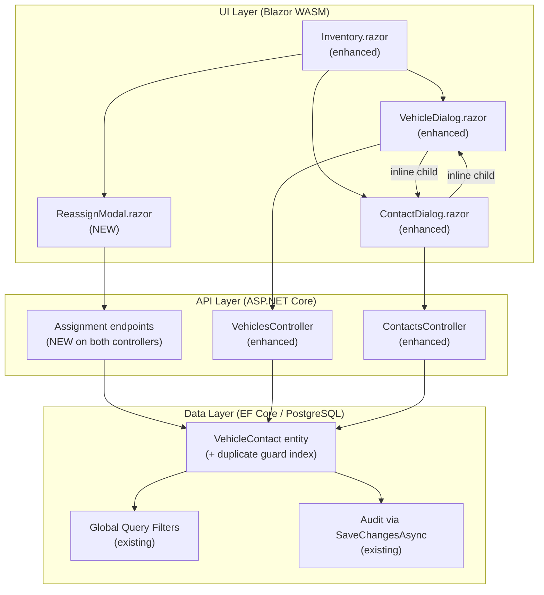
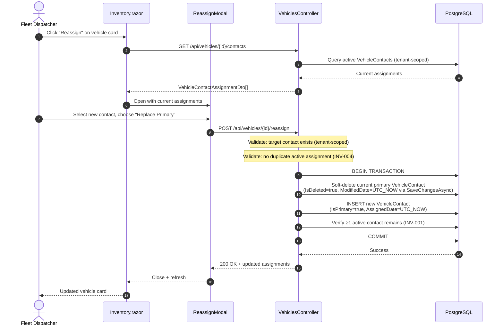
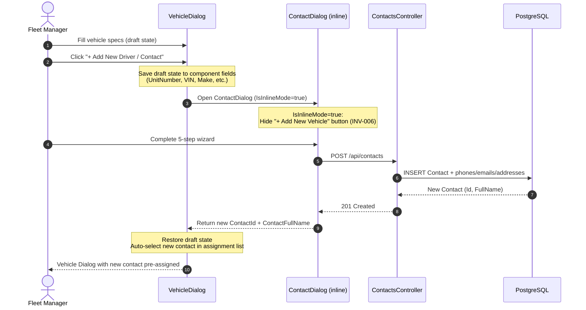
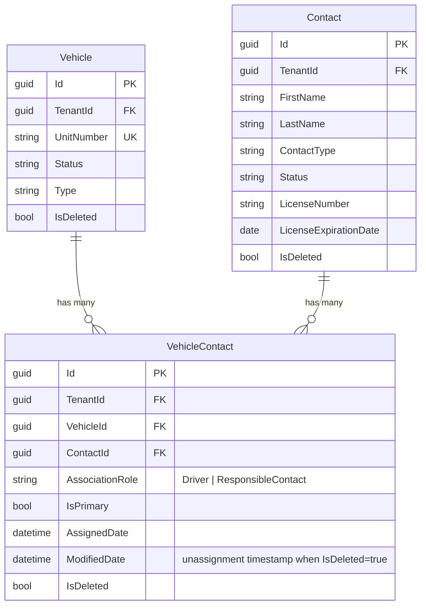

# FEATURE-002 — Design: Vehicle and Person Assignment / Reassignment

> **Status**: `APPROVED`  
> **Requirements Baseline**: [`requirements.md`](requirements.md) (Status: `APPROVED`)  
> **Created**: 2026-10-01  
> **Author**: AI Architecture Agent  
> **Gate 2 Approval**: [x] Approved by Human (Date: 2026-10-01)

---

## 1. Architectural Context & Objectives

### 1.1 Current Architecture State

The FleetNexus platform follows a three-tier architecture:

| Layer | Project | Current State |
| :--- | :--- | :--- |
| **Data** | `appfleet-nexus-data` | `BaseEntity` provides `TenantId`, audit columns, and `IsDeleted` soft-delete. `Vehicle`, `Contact`, and `VehicleContact` entities exist with M:M join (ADR-022). `FleetNexusDbContext` applies global query filters for tenant isolation + soft-delete. |
| **Security** | `appfleet-nexus-security` | `ITenantContextAccessor` extracts tenant/user context from JWT claims. Three-tier RBAC: Admin, Member, SuperAdmin (ADR-010). |
| **API** | `appfleet-nexus-api` | `VehiclesController` handles CRUD + contact assignment sync. `ContactsController` handles contact CRUD. Direct `DbContext` usage in controllers (no MediatR/service layer extraction yet). |
| **UI** | `appfleet-nexus-ui` (Blazor WASM) | `Inventory.razor` renders vehicle/contact tabs (ADR-020). `VehicleDialog.razor` handles vehicle creation/editing with contact assignment. `ContactDialog.razor` handles 5-step contact wizard (ADR-018). |

**Key Observations from Codebase Inspection:**

1. **No dedicated reassignment endpoint exists.** Vehicle contact assignment is managed inline during full vehicle create/update (`PUT /api/vehicles/{id}`), which replaces all assignments via delete-then-recreate. This pattern lacks granularity for quick reassignment.
2. **Both PUT endpoints use a destructive delete-and-recreate sync pattern** — every vehicle or contact save removes ALL `VehicleContact` rows and re-inserts them, destroying original `AssignedDate` values and creating unnecessary soft-deleted churn. This is pre-existing tech debt that directly undermines assignment audit integrity.
3. **No dedicated "Reassign" UI component** exists — reassignment is currently possible only through the full vehicle edit dialog.
4. **No multi-vehicle batch assignment** from a contact's profile exists.
5. **No inline child entity creation** (opening Contact Wizard from Vehicle Dialog or vice versa) is implemented yet.
6. **INV-005 (sole-contact deletion guard) is already implemented** in `ContactsController.DeleteContact` — no new work needed for this invariant.

### 1.2 Proposed Architecture Overview

This feature introduces **three capabilities** and **one tech debt fix** layered on top of the existing architecture:



**Target State Summary:**
- **Data Layer**: Add partial unique index preventing duplicate active assignments (INV-004). No schema column additions — existing `ModifiedDate` on `BaseEntity` serves as unassignment timestamp when `IsDeleted = true`.
- **API Layer**: New dedicated reassign endpoint. **Fix pre-existing tech debt**: replace destructive delete-and-recreate assignment sync in both `PUT` endpoints with diff-based sync that preserves `AssignedDate` history.
- **UI Layer**: New `ReassignModal` component, enhanced `VehicleDialog`/`ContactDialog` with inline child creation + recursion guard.

---

## 2. ADR Governance & Pattern Alignment

### 2.1 Active ADR Compliance

| Governing ADR | Area of Impact | How This Feature Adheres |
| :--- | :--- | :--- |
| [ADR-003](../../adr/ADR-003-multi-tenancy-shared-schema.md) | Multi-Tenancy | `VehicleContact` inherits `TenantId` from `BaseEntity`. All new endpoints operate within tenant-scoped queries. |
| [ADR-004](../../adr/ADR-004-tenant-isolation-defense-in-depth.md) | Tenant Isolation | EF Core global query filters on `VehicleContact` already enforce `TenantId` + `!IsDeleted`. New endpoints use existing `_tenantAccessor` patterns. Cross-tenant contact/vehicle assignment prevented by query filters returning 404. |
| [ADR-010](../../adr/ADR-010-role-based-access-control.md) | Authorization | All new endpoints require `[Authorize]` (Admin + Member). Reassignment does not require Admin-only gating per ADR-010 (operational task). |
| [ADR-013](../../adr/ADR-013-user-profile-and-contact-separation.md) | Data Separation | Contacts remain independent business entities. Assigning contacts to vehicles does not create user account linkage. |
| [ADR-014](../../adr/ADR-014-soft-delete-and-audit-strategy.md) | Soft-Delete & Audit | Unassignment operations soft-delete `VehicleContact` rows (`IsDeleted = true`) and stamp `UnassignedDate = UTC_NOW`. `SaveChangesAsync` audit interception continues to set `ModifiedBy`/`ModifiedDate`. |
| [ADR-017](../../adr/ADR-017-tenant-scoped-soft-delete-unique-constraints.md) | Unique Constraints | New partial unique index on `vehicle_contacts(vehicle_id, contact_id) WHERE NOT is_deleted` prevents duplicate active assignments (INV-004). |
| [ADR-018](../../adr/ADR-018-multi-step-input-wizard-ux-pattern.md) | Wizard UX | Contact Wizard inline launch from Vehicle Dialog follows incremental disclosure pattern. Step validation gates remain active. |
| [ADR-020](../../adr/ADR-020-unified-inventory-workspace.md) | Inventory UI | Reassign button accessible from `Inventory.razor` vehicle cards/rows. |
| [ADR-022](../../adr/ADR-022-vehicle-contact-many-to-many-join-entity.md) | Join Entity | Directly extends `VehicleContact` with `UnassignedDate`. All existing FK relationships, navigation properties, and query patterns remain intact. |

### 2.2 Novel Architectural Decisions Required?

- [x] **No new ADR required**: This feature fits cleanly within existing patterns.

**Rationale:** All components (M:M join entity, soft-delete audit, tenant isolation, wizard UX, unified inventory) are governed by existing ADRs. The addition of `UnassignedDate` to `VehicleContact` is a minor schema enhancement within ADR-022's scope ("supports future metadata enrichment on the association without schema breaking changes"). The inline child creation pattern is a UI-only concern using existing component composition, not a new architectural pattern.

---

## 3. Component & System Design

### 3.1 Affected Components & Boundaries

#### 3.1.1 Data Layer (`appfleet-nexus-data`)

| Change | File | Description |
| :--- | :--- | :--- |
| **Index Addition** | [`FleetNexusDbContext.cs`](file:///c:/Learn/fleet_solution/app-fleet-nexus-net/api/appfleet-nexus-data/Data/FleetNexusDbContext.cs) | Add partial unique index `(VehicleId, ContactId) WHERE NOT IsDeleted` to prevent duplicate active assignments (INV-004) |
| **Migration** | `Migrations/` | New EF Core migration: `AddDuplicateAssignmentGuard` |

> [!NOTE]
> **Decision**: `UnassignedDate` column **not added**. The existing `ModifiedDate` on `BaseEntity` (stamped automatically by `SaveChangesAsync` on soft-delete) already serves as the unassignment timestamp. Adding a redundant column was rejected to avoid speculative complexity.

#### 3.1.2 API Layer (`appfleet-nexus-api`)

| Change | File | Description |
| :--- | :--- | :--- |
| **New DTO** | [`VehicleDtos.cs`](file:///c:/Learn/fleet_solution/app-fleet-nexus-net/api/appfleet-nexus-api/Models/VehicleDtos.cs) | Add `ReassignVehicleRequest` DTO with `NewContactId`, `AssociationRole`, `ReassignMode` (ReplacePrimary / AddSecondary) |
| **New Endpoint** | [`VehiclesController.cs`](file:///c:/Learn/fleet_solution/app-fleet-nexus-net/api/appfleet-nexus-api/Controllers/VehiclesController.cs) | `POST /api/vehicles/{id}/reassign` — Quick Reassign with Replace Primary / Add Secondary modes |
| **Tech Debt Fix** | [`VehiclesController.cs`](file:///c:/Learn/fleet_solution/app-fleet-nexus-net/api/appfleet-nexus-api/Controllers/VehiclesController.cs) | Replace destructive delete-and-recreate assignment sync in `PUT /api/vehicles/{id}` with **diff-based sync**: only soft-delete removed assignments, only insert new ones, preserve `AssignedDate` on unchanged assignments |
| **Tech Debt Fix** | [`ContactsController.cs`](file:///c:/Learn/fleet_solution/app-fleet-nexus-net/api/appfleet-nexus-api/Controllers/ContactsController.cs) | Replace destructive delete-and-recreate assignment sync in `PUT /api/contacts/{id}` with **diff-based sync** (same pattern as VehiclesController) |

> [!NOTE]
> **INV-005 (sole-contact deletion guard)** is already implemented in `ContactsController.DeleteContact` (lines 517–536). No new work required — verified during architecture review.

#### 3.1.3 UI Layer (`appfleet-nexus-ui`)

| Change | File | Description |
| :--- | :--- | :--- |
| **New Component** | `Components/ReassignModal.razor` **(NEW)** | Dedicated Quick Reassign Modal — shows current assignments, contact picker with compliance badges, Replace Primary / Add Secondary toggle |
| **Enhanced** | [`VehicleDialog.razor`](file:///c:/Learn/fleet_solution/app-fleet-nexus-net/ui/appfleet-nexus-ui/Components/VehicleDialog.razor) | Add "+ Add New Driver / Contact" button that launches `ContactDialog` inline. Add `IsInlineMode` parameter to suppress recursive child creation (INV-006). Preserve parent draft state via component parameters. |
| **Enhanced** | [`ContactDialog.razor`](file:///c:/Learn/fleet_solution/app-fleet-nexus-net/ui/appfleet-nexus-ui/Components/ContactDialog.razor) | Add "+ Add New Vehicle" button on Step 5 that launches `VehicleDialog` inline. Add `IsInlineMode` parameter to suppress recursive child creation (INV-006). |
| **Enhanced** | [`Inventory.razor`](file:///c:/Learn/fleet_solution/app-fleet-nexus-net/ui/appfleet-nexus-ui/Pages/Inventory.razor) | Add "Reassign" action button on vehicle cards/rows. Wire up ReassignModal component. |

> [!NOTE]
> **Deferred (DEFER-001)**: `MultiVehicleAssignPanel.razor` and "Assign Vehicles" contact-tab action are deferred to a future release. See [`DEFERRED.md`](file:///c:/Learn/fleet_solution/docs/DEFERRED.md).

#### 3.1.4 Security Layer (`appfleet-nexus-security`)

No changes required. Existing `[Authorize]` attribute, `ITenantContextAccessor`, and global query filters provide sufficient authorization and tenant isolation for all new endpoints.

### 3.2 Data Flow Diagrams

#### Flow 1: Quick Reassign Vehicle (UC-5 — Replace Primary)



#### Flow 2: Inline Contact Creation from Vehicle Dialog (UC-2)



#### ~~Flow 3: Multi-Vehicle Assignment (UC-6)~~ — DEFERRED

> [!IMPORTANT]
> **Deferred to future release ([DEFER-001](file:///c:/Learn/fleet_solution/docs/DEFERRED.md))**. UC-6 (Multi-Vehicle Batch Assignment) and its associated API endpoint (`POST /api/contacts/{id}/assign-vehicles`), DTO (`BatchAssignVehiclesRequest`), and UI component (`MultiVehicleAssignPanel.razor`) are deferred. Single-vehicle assignment via the Reassign Modal and inline creation cover core operational needs.

### 3.3 Entity Relationship Context



---

## 4. Operational & Resiliency Patterns

### 4.1 Failure Handling & Edge Case Strategy

| Scenario | Handling Strategy | HTTP Response |
| :--- | :--- | :--- |
| Reassign to non-existent contact | Tenant-scoped query returns null → 404 | `404 Not Found` |
| Reassign to contact already assigned (INV-004) | Check existing active `VehicleContact` → update role/primary status | `200 OK` (upsert) |
| Remove sole contact from active vehicle (INV-001) | Pre-persist validation count check → reject | `400 Bad Request` with message |
| Delete contact who is sole assignee (INV-005) | Query vehicles where contact is sole active → reject with blocking unit numbers | `409 Conflict` with vehicle list |
| Cross-tenant contact/vehicle reference (INV-008) | Global query filter returns 404 → prevented | `404 Not Found` |
| Concurrent reassignment (race condition) | DB partial unique index enforces constraint → catch `DbUpdateException` | `409 Conflict` |
| Nested inline creation attempt (INV-006) | `IsInlineMode=true` parameter hides child creation buttons | N/A (UI prevention) |
| Cancel inline child wizard (AC-013) | Parent draft state preserved in component fields; child wizard is isolated | N/A (UI restoration) |

### 4.2 Retry, Concurrency & Idempotency

- **Concurrency Control**: The partial unique index on `(VehicleId, ContactId) WHERE NOT IsDeleted` provides database-level concurrency safety for duplicate assignment prevention. No application-level optimistic concurrency tokens are required for `VehicleContact` since assignments are atomic, short-lived operations.
- **Idempotency**: `POST /api/vehicles/{id}/reassign` with the same contact ID and mode is idempotent — if the contact is already assigned with the requested role, the endpoint returns `200 OK` with the current state rather than creating duplicates (INV-004 upsert behavior).
- **Transaction Scope**: Reassignment operations (soft-delete old + insert new) execute within a single `SaveChangesAsync` call, leveraging EF Core's implicit transaction.

### 4.3 Observability & Telemetry

| Event | Log Level | Structured Fields |
| :--- | :--- | :--- |
| `VehicleReassigned` | `Information` | `VehicleId`, `OldContactId`, `NewContactId`, `Mode` (ReplacePrimary/AddSecondary) |
| `AssignmentSyncCompleted` | `Information` | `EntityType` (Vehicle/Contact), `EntityId`, `Added`, `Removed`, `Unchanged` |
| `SoleContactDeletionBlocked` | `Warning` | `ContactId`, `BlockingVehicleIds[]` |
| `DuplicateAssignmentUpserted` | `Information` | `VehicleId`, `ContactId`, `UpdatedRole`, `UpdatedIsPrimary` |
| `InlineContactCreated` | `Information` | `ContactId`, `ParentVehicleDraftId` (null for new) |

---

## 5. Alternatives Considered & Trade-offs

| Alternative Considered | Rationale for Rejection | Trade-off Accepted |
| :--- | :--- | :--- |
| **Extract Service Layer** — move assignment logic from controllers to dedicated `IAssignmentService` | Would be ideal for testability, but current codebase uses direct `DbContext` in controllers consistently. Introducing a service layer for one feature would create inconsistency. | Accept controller-based logic with good method extraction. Revisit service layer extraction as a cross-cutting refactor. |
| **Add `UnassignedDate` column** to `VehicleContact` for explicit unassignment audit | Semantic clarity for compliance queries. | Rejected: redundant with existing `ModifiedDate` on `BaseEntity`, which is automatically stamped on soft-delete. A dedicated column adds schema surface for no additional data. Can be added later if reactivation scenarios require distinguishing modification from unassignment. |
| **Separate Reassign API controller** (`AssignmentsController`) | Clean separation of concerns for assignment-only operations. | Rejected: would fragment the resource-oriented REST structure. Reassignment is a sub-resource operation on `/api/vehicles/{id}` and `/api/contacts/{id}`. Keeping them on existing controllers maintains URL consistency. |
| **WebSocket/SignalR push for real-time UI updates** after reassignment | Would provide instant multi-user update in inventory views. | Rejected: premature optimization for MVP. HTTP polling and post-action refresh are sufficient for current user counts. Can be added as a future enhancement. |
| **Full modal-within-modal** for inline child creation | Browser-native modal stacking. | Rejected: complex z-index management and accessibility issues. Instead, replace parent modal content with child wizard content in the same modal container, preserving parent state in component fields. |

---

## 6. Migration & Rollback Strategy

### 6.1 Database Migration

```sql
-- Forward migration
CREATE UNIQUE INDEX ix_vehicle_contacts_vehicle_contact_active
ON vehicle_contacts ("VehicleId", "ContactId")
WHERE "IsDeleted" = false;
```

### 6.2 Rollback

```sql
-- Rollback migration
DROP INDEX IF EXISTS ix_vehicle_contacts_vehicle_contact_active;
```

**Rollback Safety**: The unique index is purely additive — dropping it returns to the previous state with no data loss. No schema columns are added or removed in this feature.

---

## 7. Implementation Sequencing Recommendation

The recommended implementation order ensures each phase is independently testable:

| Phase | Scope | Dependencies |
| :--- | :--- | :--- |
| **Phase 1** | Data layer: partial unique index `(VehicleId, ContactId) WHERE NOT IsDeleted` + EF migration | None |
| **Phase 2** | API tech debt fix: replace destructive delete-and-recreate assignment sync with diff-based sync in `VehiclesController.UpdateVehicle` and `ContactsController.UpdateContact` | Phase 1 |
| **Phase 3** | API: `POST /api/vehicles/{id}/reassign` endpoint with Replace Primary / Add Secondary modes | Phase 1 |
| **Phase 4** | UI: `ReassignModal.razor` + Inventory "Reassign" button integration | Phase 3 |
| **Phase 5** | UI: Inline child creation (`VehicleDialog ↔ ContactDialog`) with `IsInlineMode` + draft preservation | Phase 2 |

> [!NOTE]
> **Deferred phases** (see [`DEFERRED.md`](file:///c:/Learn/fleet_solution/docs/DEFERRED.md)):
> - ~~Phase N~~ API: `POST /api/contacts/{id}/assign-vehicles` batch endpoint → `DEFER-001`
> - ~~Phase N~~ UI: `MultiVehicleAssignPanel.razor` + Inventory integration → `DEFER-001`
