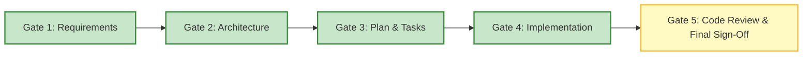

# Feature Status: FEATURE-002-vehicle-person-assignment

## Vehicle and Person Assignment & Reassignment

| Attribute | Value |
| :--- | :--- |
| **Feature ID** | `FEATURE-002-vehicle-person-assignment` |
| **Current Phase** | `READY_FOR_IMPLEMENTATION` |
| **Complexity** | `STANDARD` |
| **Created** | 2026-10-01 |
| **Author** | AI Planning Agent |

---

## Lifecycle Stage Gates

| Phase | Status | Approval Date | Notes |
| :--- | :--- | :--- | :--- |
| **1. Discovery & Requirements** | `APPROVED` | 2026-10-01 | Requirements approved with 13 ACs, 9 invariants, 8 decisions. |
| **2. Architecture & Design** | `APPROVED` | 2026-10-01 | Approved after critical review: dropped UnassignedDate, fixed delete-and-recreate tech debt, confirmed INV-005 exists. |
| **3. Plan & Tasks** | `APPROVED` | 2026-10-02 | Implementation plan, independent test plan, initialized evidence matrix, and 6 task contracts approved by Human. |
| **4. Task Breakdown & Execution** | `APPROVED` | 2026-10-02 | Phase 1 Backend & Data (Tasks 001–003) executed and VERIFIED. Tasks 004–006 deferred to Phase 2. |
| **5. Review & Final Sign-Off** | `IN_REVIEW` | — | Review report prepared for Human Final Approval & Merge. |

---

## Artifact Index

- [requirements.md](file:///c:/Learn/fleet_solution/docs/features/FEATURE-002-vehicle-person-assignment/requirements.md)
- [design.md](file:///c:/Learn/fleet_solution/docs/features/FEATURE-002-vehicle-person-assignment/design.md)
- [implementation-plan.md](file:///c:/Learn/fleet_solution/docs/features/FEATURE-002-vehicle-person-assignment/implementation-plan.md)
- [test-plan.md](file:///c:/Learn/fleet_solution/docs/features/FEATURE-002-vehicle-person-assignment/test-plan.md)
- [evidence.md](file:///c:/Learn/fleet_solution/docs/features/FEATURE-002-vehicle-person-assignment/evidence.md)
- **Task Contracts**:
  - [001-data-layer-and-migrations.md](file:///c:/Learn/fleet_solution/docs/features/FEATURE-002-vehicle-person-assignment/tasks/001-data-layer-and-migrations.md)
  - [002-api-diff-sync-tech-debt-fix.md](file:///c:/Learn/fleet_solution/docs/features/FEATURE-002-vehicle-person-assignment/tasks/002-api-diff-sync-tech-debt-fix.md)
  - [003-api-reassign-endpoint.md](file:///c:/Learn/fleet_solution/docs/features/FEATURE-002-vehicle-person-assignment/tasks/003-api-reassign-endpoint.md)
  - [004-ui-reassign-modal-and-inventory.md](file:///c:/Learn/fleet_solution/docs/features/FEATURE-002-vehicle-person-assignment/tasks/004-ui-reassign-modal-and-inventory.md)
  - [005-ui-inline-dialog-nesting-and-guards.md](file:///c:/Learn/fleet_solution/docs/features/FEATURE-002-vehicle-person-assignment/tasks/005-ui-inline-dialog-nesting-and-guards.md)
  - [006-integration-tests-and-evidence.md](file:///c:/Learn/fleet_solution/docs/features/FEATURE-002-vehicle-person-assignment/tasks/006-integration-tests-and-evidence.md)
